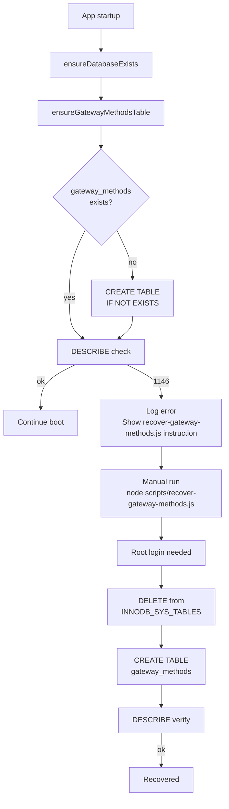
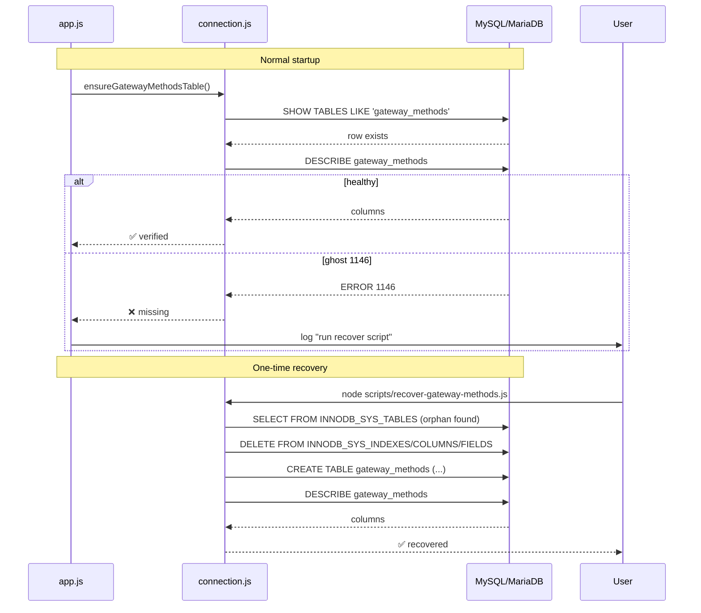

## Plan: Fix gateway_methods orphan entry

**TL;DR** — Catalog-এ `gateway_methods` entry আছে কিন্তু ফাইল নেই, তাই `DROP TABLE`/`CREATE TABLE` দুটোই ব্যর্থ হচ্ছে (errno 121 বা 1146)। MariaDB-র `information_schema.INNODB_SYS_TABLES` থেকে orphan row ডিলিট করে (শুধু root user-এ সম্ভব), তারপর fresh CREATE — এটাই একমাত্র reliable fix।

**Steps**

1. **Orphan entry live verification** — PowerShell-এ `mysql.exe --password=` দিয়ে দুটো query চালাও:
   - `SELECT * FROM information_schema.INNODB_SYS_TABLES WHERE NAME LIKE '%gateway_methods%';` (catalog-তে আছে কিনা)
   - `SELECT * FROM information_schema.INNODB_SYS_INDEXES WHERE TABLE_ID IN (SELECT TABLE_ID FROM information_schema.INNODB_SYS_TABLES WHERE NAME LIKE '%gateway_methods%');` (orphan indexes)
   - `Get-ChildItem C:\xampp\mysql\data\paychek_online_v2\gateway_methods*` (ফাইল আছে কিনা)
   - যদি `INNODB_SYS_TABLES` এ row থাকে কিন্তু ফাইল না থাকে → confirmed orphan।
2. **Connection user audit** — `app.js` / `db/connection.js` DB_USER দেখো (এখন root ধরে নিচ্ছি)। যদি root না হয়ে থাকে তাহলে `.env` এ `DB_USER=root` সেট করো, কারণ orphan cleanup-এর জন্য `PROCESS` + `SUPER` privilege লাগে।
3. **Recovery script** — `backend/scripts/recover-gateway-methods.js` ফাইল তৈরি করো যেটা:
   - Pool connect করে (root user)
   - Try block 1: `DROP TABLE IF EXISTS gateway_methods` (যদি catalog-এ থাকে কিন্তু corrupt থাকে, এটা ব্যর্থ হবে — সেটা OK)
   - Try block 2: `information_schema.INNODB_SYS_TABLES` থেকে orphan row DELETE করে `paychek_online_v2/gateway_methods` এর TABLE_ID বের করে, তারপর `INNODB_SYS_INDEXES`, `INNODB_SYS_COLUMNS`, `INNODB_SYS_FIELDS` থেকেও DELETE (FK order)
   - সবকিছু `SET FOREIGN_KEY_CHECKS=0` wrapper-এ
   - তারপর fresh `CREATE TABLE gateway_methods (...)` (তোমার দেওয়া schema, FK ছাড়া)
   - তারপর `SET FOREIGN_KEY_CHECKS=1`
   - শেষে `DESCRIBE gateway_methods` দিয়ে verify করে console-এ print করবে
   - Exit code: orphan পাওয়া গেলে 0 (recovered), কিছু ভুল হলে 2
4. **Safe-run mode for non-root user** — recovery script এর শুরুতে check করবে: যদি DB_USER root না হয়, তাহলে শুধু informative message log করে exit করবে (orphan cleanup-এর জন্য root অপরিহার্য)। App crash হবে না।
5. **Startup guard** — `db/connection.js` export-এ নতুন `ensureGatewayMethodsTable()` function add করো যেটা শুধু `CREATE TABLE IF NOT EXISTS gateway_methods (...)` চেক করে। যদি টেবিল `DESCRIBE` দিয়ে verify হয়, no-op। এটা app boot-এ `app.js` line ~80 এ (existing schema install block-এর পাশে) call হবে। `recover-*.js` এর rescue-এর পর এই guard future ghost-creation ঠেকাবে।
6. **App.js wiring** — `app.js` startup section-এ (যেখানে `ensureDatabaseExists()` call হয়) নিচের order:
   ```
   await ensureDatabaseExists();
   await ensureGatewayMethodsTable();
   ```
   এটা শুধু `CREATE TABLE IF NOT EXISTS` চালায়, তাই ghost থাকলে skip করবে, না থাকলে বানাবে।
7. **One-time manual run** — `cd D:\payment_checker_native_android\backend && node scripts/recover-gateway-methods.js`। Expected output: catalog-এ entry পাওয়া যাবে, file নেই confirm হবে, DELETE চলবে, fresh CREATE হবে, শেষে DESCRIBE আউটপুট দেখাবে।
8. **Backend restart** — `node app.js` (বা `start-server.bat`)। Log-এ দেখবে `[DB] ✅ gateway_methods table verified.` (যদি টেবিল আগে থেকে থাকে) বা `[DB] ✅ gateway_methods table created.` (যদি নতুন বানায়)।
9. **End-to-end test** — Android app-এ নতুন signup → complete-profile → ngrok log-এ `POST /api/complete-profile 200 OK` দেখবে।

**Relevant files**
- `backend/scripts/recover-gateway-methods.js` — নতুন, recovery logic + DESCRIBE verify
- `backend/db/connection.js` — add `ensureGatewayMethodsTable()` export (lines 53-57 এর module.exports-এ)
- `backend/app.js` — line 80 এর পাশে `await ensureGatewayMethodsTable();` call যোগ
- `backend/.env` — verify `DB_USER=root` (orphan DELETE-এর জন্য প্রয়োজন)

**Diagrams**





**Verification**
1. `& "C:\xampp\mysql\bin\mysql.exe" -h 127.0.0.1 -u root --password= paychek_online_v2 -e "DESCRIBE gateway_methods;"` — সব column দেখাবে (id, user_id, sim_slot, provider, number, display_name, is_enabled, priority, template_id, created_at, updated_at)
2. `Get-ChildItem C:\xampp\mysql\data\paychek_online_v2\gateway_methods*` — `gateway_methods.frm` + `gateway_methods.ibd` দুটোই থাকবে
3. `node scripts/check-tables.js` — `gateway_methods` এ `✓` marker সহ ১৪ থেকে ১৫ টেবিল দেখাবে (EXPECTED_TABLES list-এ add করতে হবে যদি আগে না থাকে)
4. App-এ fresh signup → `POST /api/complete-profile` → 200 OK (ngrok log-এ)
