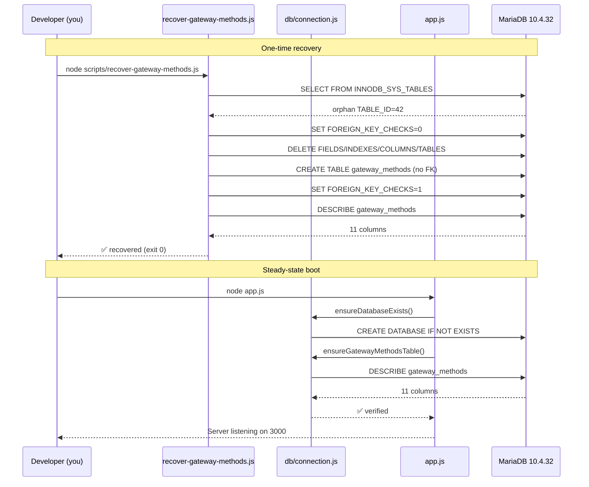

## Plan: Fix gateway_methods orphan (final, no schema.sql change)

**TL;DR** — Catalog-এ `gateway_methods` entry আছে কিন্তু `.frm`/`.ibd` নেই, তাই `DESCRIBE` 1146 দিচ্ছে। Plan: (1) root-privilege এ `INNODB_SYS_*` family থেকে orphan rows মুছে fresh `CREATE TABLE` করবে `recover-gateway-methods.js`, (2) `db/connection.js`-এ `ensureGatewayMethodsTable()` guard `DESCRIBE` failure-এ `CREATE TABLE IF NOT EXISTS` চালাবে, (3) `app.js` boot-এ call হবে। `schema.sql` এ কোনো পরিবর্তন নেই (তোমার সিদ্ধান্ত)।

**Steps**

1. **Confirm DB_USER=root in `.env`** — `backend/.env` line 4 এ `DB_USER=root` আছে, line 5 এ `DB_PASS=` খালি (XAMPP default)। OK। কিছু করতে হবে না।
2. **Create `backend/scripts/recover-gateway-methods.js`** — root-privilege gate (`process.exit(2)` যদি root না হয়), `SET FOREIGN_KEY_CHECKS=0`, orphan `TABLE_ID` lookup, dependent `INNODB_SYS_FIELDS` → `INNODB_SYS_INDEXES` → `INNODB_SYS_COLUMNS` → `INNODB_SYS_TABLES` order-এ DELETE, fresh `CREATE TABLE gateway_methods (...)` (no FK), `SET FOREIGN_KEY_CHECKS=1`, `DESCRIBE gateway_methods` দিয়ে column list print।
3. **Edit `backend/db/connection.js`** — `query` helper-এর পরে `ensureGatewayMethodsTable()` function add করো। Logic: `try { await query('DESCRIBE gateway_methods') }` — success হলে `✅ verified` log, fail (errno 1146 বা অন্য কিছু) হলে `CREATE TABLE IF NOT EXISTS gateway_methods (...)` চালাও (no FK, তোমার plan অনুযায়ী schema)। `module.exports` এ function add।
4. **Edit `backend/app.js`** — line 7 এ import line update: `const { query, ensureDatabaseExists, ensureGatewayMethodsTable } = require('./db/connection');`। `app.listen` callback (line 85+) এ `console.log` block-এর পরে, request listener শুরু হওয়ার আগে:
   ```js
   await ensureDatabaseExists();
   await ensureGatewayMethodsTable();
   ```
5. **Run one-shot recovery** — PowerShell-এ `cd D:\payment_checker_native_android\backend && node scripts/recover-gateway-methods.js`। Expected: `[RECOVER] Found orphan TABLE_ID=...` → 4 DELETE summary → `✅ Fresh gateway_methods table created` → column list (11 columns: id, user_id, sim_slot, provider, number, display_name, is_enabled, priority, template_id, created_at, updated_at) → `✅ gateway_methods is healthy`। Exit code 0।
6. **Restart backend** — `start-server.bat` বা `node app.js`। Log-এ দেখবে:
   ```
   [DB] ✅ Database "paychek_online_v2" is ready.
   [DB] ✅ gateway_methods table verified.        ← guard no-op কারণ recover script-এ create হয়ে গেছে
   Payment Checker API Server running on port 3000
   ```
7. **End-to-end test** — Android app-এ নতুন signup + complete-profile। ngrok log-এ `POST /api/complete-profile 200 OK` (আগে 500 দিচ্ছিল)।

**Relevant files**
- `backend/scripts/recover-gateway-methods.js` — **NEW** root-only one-shot recovery (orphan cleanup + create + describe verify)
- `backend/db/connection.js` — add `ensureGatewayMethodsTable()` function (after `query` helper) and export it
- `backend/app.js` — line 7 import update + `app.listen` callback-এ 2-line guard call
- `backend/.env` — verified, no change needed (already `DB_USER=root`, `DB_PASS=`)

**Diagrams**

```mermaid
flowchart TD
    A[App startup: app.js] --> B[ensureDatabaseExists]
    B --> C[ensureGatewayMethodsTable guard]
    C --> D{DESCRIBE gateway_methods<br/>succeeds?}
    D -- yes --> E[✅ verified log<br/>no-op]
    D -- no 1146 --> F[CREATE TABLE IF NOT EXISTS<br/>gateway_methods - no FK]
    F --> G[✅ created log]
    E --> H[Continue boot]
    G --> H
    H -.-> I[App accepts signup + complete-profile]
    I -.-> J[Auth/completeProfile inserts<br/>SIM-1/SIM-2 methods]
    Note over J: App writes use 11-column schema<br/>provided in guard + recover script

    K[Manual one-shot] -.-> L[node scripts/recover-gateway-methods.js]
    L --> M{DB_USER==root?}
    M -- no --> Z[exit 2 informative log]
    M -- yes --> N[Lookup orphan in<br/>INNODB_SYS_TABLES]
    N --> O[DELETE rows in<br/>FIELDS→INDEXES→COLUMNS→TABLES]
    O --> P[CREATE TABLE gateway_methods]
    P --> Q[DESCRIBE verify<br/>print 11 columns]
```



**Verification**
1. `node scripts/recover-gateway-methods.js` — exit 0, last line `✅ gateway_methods is healthy. 11 columns visible.`
2. `& "C:\xampp\mysql\bin\mysql.exe" -h 127.0.0.1 -u root --password= paychek_online_v2 -e "DESCRIBE gateway_methods;"` — 11 row output (id, user_id, sim_slot, provider, number, display_name, is_enabled, priority, template_id, created_at, updated_at)
3. `Get-ChildItem C:\xampp\mysql\data\paychek_online_v2\gateway_methods*` — `.frm` + `.ibd` দুটোই present
4. `node app.js` — log-এ `[DB] ✅ gateway_methods table verified.`
5. App signup flow — `POST /api/complete-profile` returns 200 OK in ngrok log
