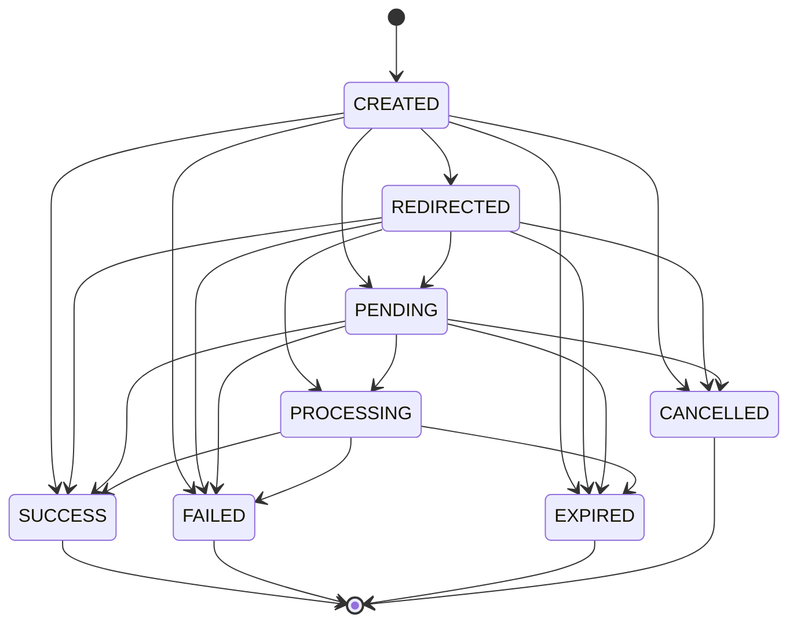

# PayChek Payment Lifecycle Specification v1.0

> **Status:** FROZEN — foundation for Phase-3B  
> **Principle:** Refactor without behavior change until Phase-3B wires `bkash_live` end-to-end  
> **Checkout UI:** FROZEN — `backend/public/js/checkout/**`

---

## 1. Purpose

This document freezes the payment lifecycle contract before Phase-3B implementation:

- State Machine transitions
- Event list
- Merchant Callback JSON v1.0
- Idempotency rules
- Retry policy
- Error codes
- Trace propagation

**Rule:** Do not break v1 contracts. Add v2 with explicit version when extending.

---

## 2. Lifecycle Flow (Target — Phase-3B)

```
Init (PaymentEngine.initiate)
  ↓
Redirect (GET /pay/:token → RedirectService)
  ↓
Gateway (official provider)
  ↓
Return / Callback (GatewayCallbackReceived)
  ↓
Verify (adapter.verify)
  ↓
Normalize (adapter.normalize)
  ↓
Merchant Callback (RetryEngine)
  ↓
Complete (PaymentCompleted)
```

**Phase-3B scope:** Implement full lifecycle for **one provider only** (`bkash_live`).  
Do not add SSLCommerz / SurjoPay / PortWallet until `bkash_live` is 100% stable.

---

## 3. State Machine

### Canonical States

| State | Legacy DB (`payment_sessions.status`) | Terminal |
|-------|--------------------------------------|----------|
| CREATED | created | |
| REDIRECTED | redirected | |
| PENDING | redirected | |
| PROCESSING | redirected | |
| SUCCESS | completed | ✓ |
| FAILED | failed | ✓ |
| EXPIRED | expired | ✓ |
| CANCELLED | failed | ✓ |

### Allowed Transitions

```
CREATED     → REDIRECTED | PENDING | SUCCESS | FAILED | EXPIRED | CANCELLED
REDIRECTED  → PENDING | PROCESSING | SUCCESS | FAILED | EXPIRED | CANCELLED
PENDING     → PROCESSING | SUCCESS | FAILED | EXPIRED | CANCELLED
PROCESSING  → SUCCESS | FAILED | EXPIRED
SUCCESS     → (none)
FAILED      → (none)
EXPIRED     → (none)
CANCELLED   → (none)
```

**Forbidden:** `FAILED → SUCCESS`, `EXPIRED → SUCCESS`, `SUCCESS → FAILED`

### State Diagram (FROZEN v1.0)



Implementation: `payment/state/payment-state-machine.js`  
Enforced by: `PaymentSessionEngine.updateStatus()`

---

## 4. Event Bus

| Event | When |
|-------|------|
| `PaymentCreated` | Session created after initiate |
| `PaymentRedirected` | Customer sent to gateway |
| `GatewayCallbackReceived` | Inbound provider callback |
| `PaymentVerified` | adapter.verify() success |
| `MerchantCallbackSent` | Outbound webhook delivered |
| `PaymentCompleted` | Terminal success |
| `PaymentFailed` | Terminal failure |
| `PaymentExpired` | Session TTL exceeded |
| `PaymentCancelled` | User / merchant cancel |

Implementation: `payment/events/event-bus.js`  
**Frozen names:** `payment/events/EVENTS_FROZEN.md` — do not rename.

Listeners (Phase-3B+): analytics, audit DB, SMS, email — attach via `onPaymentEvent()`.

---

## 5. Merchant Callback JSON v1.0 (FROZEN)

```json
{
  "paymentId": "ps_abc123...",
  "merchantId": "42",
  "websiteId": "7",
  "provider": "bkash_live",
  "providerTransactionId": "TXN123",
  "merchantTransactionId": "ORD-001",
  "amount": 500,
  "status": "SUCCESS",
  "type": "bkash_personal",
  "commission": 5,
  "traceId": "ptr_a1b2c3d4",
  "timestamp": "2026-07-06T12:00:00.000Z",
  "currency": "BDT"
}
```

- Schema: `payment/core/merchant-callback-v1.js`
- Builder: `buildMerchantCallbackV1()`
- Validator: `validateMerchantCallbackV1()`
- **additionalProperties: false** in v1

---

## 6. Idempotency Rules

**Problem:** Gateway callbacks arrive 2×, 3×, 5×.

**Key format:** `callback:{providerId}:{providerTransactionId}` or `callback:{sessionToken}:{eventHash}`

| Method | Purpose |
|--------|---------|
| `check(key)` | Already processed? Return cached result |
| `lock(key)` | SET NX — acquire processing lock |
| `complete(key, result)` | Store result for replay (24h TTL) |

Implementation: `payment/idempotency/idempotency-manager.js` (Redis + memory fallback)

**Rule:** Completed sessions never re-fire merchant callbacks.

---

## 7. Retry Policy

### Merchant Callback

| Attempt | Delay |
|---------|-------|
| 1 | immediate |
| 2 | +1s (jitter) |
| 3 | +5s |
| 4 | +30s → **Dead Queue** |

Implementation: `payment/retry/retry-engine.js` + `retry-policy.js`

---

## 8. Error Code Registry (FROZEN)

| Code | Message | HTTP |
|------|---------|------|
| `PAY_1001` | Invalid API Key | 404 |
| `PAY_1002` | PROVIDER_NOT_CONFIGURED (disabled) | 400 |
| `PAY_1003` | PROVIDER_NOT_CONFIGURED (maintenance) | 400 |
| `PAY_1004` | SESSION_NOT_FOUND | 404 |
| `PAY_1005` | INVALID_SIGNATURE | 401 |
| `PAY_1006` | DUPLICATE_CALLBACK | 409 |
| `PAY_1007` | SESSION_EXPIRED | 410 |
| `PAY_1008` | INVALID_STATE_TRANSITION | 409 |
| `PAY_1009` | Missing params | 400 |
| `PAY_1010` | INVALID_AMOUNT | 400 |
| `PAY_1011` | PROVIDER_NOT_CONFIGURED | 400 |
| `PAY_1999` | Internal Server Error | 500 |

Implementation: `payment/errors/error-codes.js` + `error-registry.js`  
API responses: `{ success: false, error: "<message>", errorCode: "PAY_1xxx" }` — `error` unchanged for backward compatibility.

---

## 9. PaymentContext v1.0 (FROZEN)

Root-level fields are **immutable**. New data → `metadata`, `metadata.custom`, or `metadata.extra` only.

Implementation: `payment/core/payment-context-v1.js` + `engine/payment-context.js`

---

## 10. Provider Version Contract (FROZEN)

```
Adapter v1.0 → Provider API vX.Y → Merchant Callback v1.0
```

Registry fields: `adapterVersion`, `contractVersion`, `providerApiVersion`, `merchantCallbackVersion`  
`bkash_live`: adapter `1.0`, bKash API `2.1`, callback `1.0`

Implementation: `payment/core/provider-version-contract.js`

---

## 11. Trace Propagation

Every payment flow carries one `traceId` (`ptr_` prefix):

```
PaymentEngine → Provider → Session → Redirect → Gateway → Callback → Merchant Callback
```

- Generator: `logging/trace-logger.createTraceId()`
- Context: `logging/trace-context.runWithTrace()`
- Storage: `payment_sessions.meta_json.traceId`
- Logs: JSON structured `{ ts, traceId, stage, message, ... }`

---

## 12. Monitoring

`payment/monitoring/payment-monitor.js`

| Metric | Stage key |
|--------|-----------|
| Engine latency | `engine` |
| Redirect latency | `redirect` |
| Gateway latency | `gateway` |
| Callback latency | `callback` |
| Merchant callback latency | `merchant_callback` |

Provider probes: `adapter.health()` (internal) + `adapter.ping()` (reachability).

---

## 13. Registry Cache

```
Registry (in-memory) → Redis (paychek:registry:*) → PaymentEngine
```

Implementation: `payment/registry/provider-cache.js`  
TTL: 300s. Invalidation on admin provider update (Phase-3B admin).

---

## 14. Folder Structure (Post-Foundation)

```
payment/
├── LIFECYCLE_SPEC.md          ← this document
├── CONTRACT.md
├── index.js
├── core/
│   ├── payment-types.js
│   ├── payment-status.js
│   ├── provider-flags.js
│   ├── callback-schema.js
│   └── merchant-callback-v1.js
├── registry/
│   ├── provider-registry.js
│   ├── provider-alias.js
│   ├── provider-factory.js
│   └── provider-cache.js
├── providers/
├── engine/
├── session/
├── redirect/
├── callback/                   ← Phase-3B
├── commission/                 ← Phase-3C
├── errors/
│   ├── error-codes.js
│   └── error-registry.js
├── events/
│   ├── EVENTS_FROZEN.md
│   ├── payment-events.js
│   ├── event-bus.js
│   └── listeners/
├── state/
│   └── payment-state-machine.js
├── idempotency/
│   └── idempotency-manager.js
├── retry/
│   ├── retry-policy.js
│   └── retry-engine.js
├── logging/
│   ├── trace-logger.js
│   └── trace-context.js
└── monitoring/
    └── payment-monitor.js
```

---

## 15. Provider Certification

See `payment/PROVIDER_CERTIFICATION.md` — provider NOT production until checklist complete.

---

## 16. Phase-3B Entry Checklist

Before implementing `bkash_live` callback:

- [ ] Read this spec
- [ ] Wire `paymentFlowController` → SessionEngine + StateMachine + Events
- [ ] Wire gateway callback → IdempotencyManager
- [ ] Wire merchant webhook → RetryEngine + MerchantCallbackV1
- [ ] Do **not** add new providers until `bkash_live` lifecycle is stable

---

## 17. Phase-3B Success Criteria

- [ ] One `bkash_live` payment completes Init → Complete end-to-end
- [ ] Duplicate callback (10×) processes only once (idempotency)
- [ ] Invalid signature rejected (`PAY_1005`)
- [ ] Merchant callback retries on failure (RetryEngine)
- [ ] All logs share one `traceId`
- [ ] Full event timeline emitted
- [ ] State machine blocks illegal transitions
- [ ] Callback payload always Merchant Callback v1.0

**Out of scope:** SSLCommerz, SurjoPay, PortWallet, Commission, Type Callback, UI, DB migration.

---

## 18. Version History

| Version | Date | Change |
|---------|------|--------|
| 1.0 | 2026-07-06 | Initial freeze — foundation modules |
