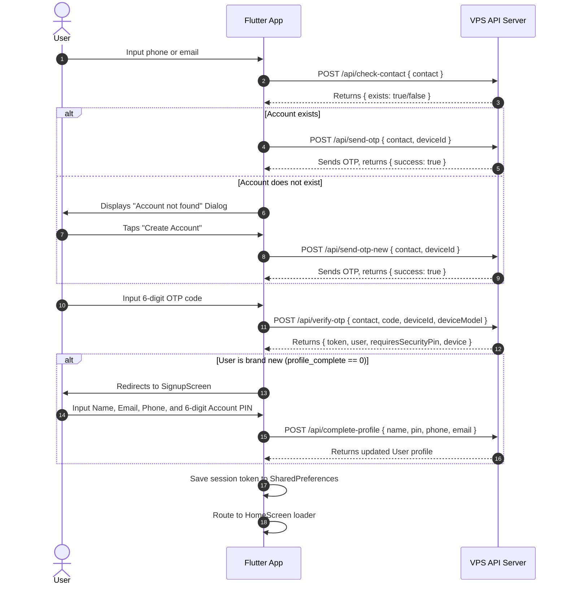
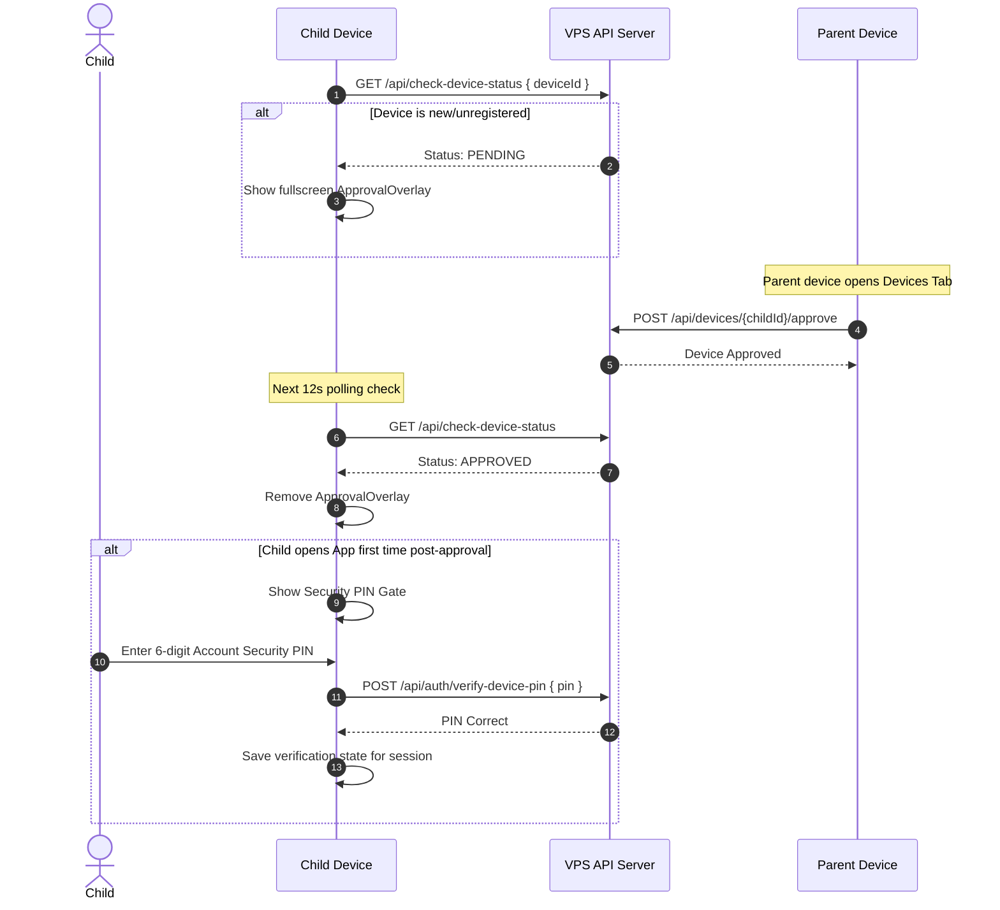

# Master Blueprint: Payment Checker & API Integration
This document provides a comprehensive, complete technical blueprint of the Payment Checker monorepo. It details the architecture, database schema, file-by-file roles for the User App, Admin App, and Server, screen UI designs, Socket.io signaling protocols, and background service mechanics. The description is structured to serve as an exact blueprint to rebuild the entire system (User App, Admin App, and Server/Backend) from scratch in any stack.

---

## 1. Project Architecture & Directory Structure

The project is structured as a multi-module monorepo containing a main **User App** (flavor-controlled), an **Admin App** (as a path dependency in the same repository), and a Node.js-based **VPS API Server**.

### High-Level Architecture Pattern
- **State Management**: MVVM using `ChangeNotifierProvider` (from the `provider` package) in both Flutter applications.
- **Local Persistence (User App)**: Dual-layer:
  - **Relational Cache**: SQLite (`sqflite`) for fast querying, compound indexing, and deduplication of transaction records.
  - **Preferences & Simple States**: SharedPreferences (`shared_preferences`) for session tokens, device settings, and configuration flags.
- **Background Pipeline**: Native Broadcast Receiver (`telephony` plugin) connected to a persistent Foreground Service (`flutter_foreground_task`) and CPU wake-locks (`wakelock_plus`).
- **P2P Sync Server**: Local embedded HTTP Server (`shelf` & `shelf_io`) running on the parent device to receive sync packages from child/sub-devices.
- **Backend API & Real-time Sync**: Express.js REST API with Socket.io real-time signaling.
- **Server Persistence**: Primary database is MySQL (via `mysql2` connection pool). PostgreSQL is optionally supported for partitioned, high-volume payment tables.

---

### A. File-by-File Analysis (User App - `lib/`)

```
lib/
├── app.dart                        # Zone-guarded bootstrap, configures root MultiProvider, routes home loaders
├── main.dart                       # Default entry point (routes to bootUserApp in app.dart)
├── main_admin.dart                 # Admin App entry point (routes to package:payment_checker_admin)
├── main_user.dart                  # Alias entry point for debugging user flavor
├── config/
│   └── api_config.dart             # API Base URL defaults, helpers to normalize endpoints
├── constants/
│   └── checkout_blocks.dart        # Core layout block definitions for checkout UI designer
├── models/
│   ├── account_credentials.dart    # Holds linked contacts (phone & email) for a user
│   ├── checkout_layout.dart        # Defines configuration layout block schema for dynamic checkouts
│   ├── child_device_remote_config.dart # Holds SIM configs (active state, allowed senders) for child devices
│   ├── device_login_check.dart     # Server check response indicating if device is bound or allowed to log in
│   ├── device_model.dart           # Model for device records (ID, name, status, role, heartbeat time, SIM values)
│   ├── device_status_result.dart   # Polled status object for child device approval status
│   ├── merchant_site.dart          # Configuration model for API checkout sites
│   ├── otp_verify_response.dart    # Verify OTP response containing session token and user details
│   ├── payment_model.dart          # Simple model representing standard transaction attributes
│   ├── payment_sms_ingest_payload.dart # REST payload structure transmitted to `/api/payment-sms-ingest`
│   ├── remote_config.dart          # Holds admin-configured toggles (maintenance, registration, tracking)
│   ├── sender_template.dart        # Configuration schema representing matches for specific operator templates
│   ├── sim_filter_preferences.dart # Local settings holding SIM slot status, number, and selected providers
│   ├── sms_model.dart              # Bare model holding basic message parameters
│   ├── sms_record.dart             # Database row model representing processed and extracted transactions
│   ├── sms_template.dart           # Regular expression template structure designed by the Admin
│   └── user_model.dart             # User profile model (roles, verification status, balance)
├── providers/
│   ├── auth_provider.dart          # Session state provider (handles login, logout, profile checks, PIN validation status)
│   ├── device_approval_provider.dart # Manages local device identification, server registration, and approval status polling
│   ├── remote_config_provider.dart # Listens to server remote configs to control feature flags
│   ├── sms_provider.dart           # Local transaction list state, operator analytics, and monitoring triggers
│   └── sync_provider.dart          # Orchestrates local configuration for P2P sync server/client modes
├── repositories/
│   ├── child_device_config_repository.dart # API-based repository to save child settings from the parent device
│   ├── merchant_api_repository.dart# Handles backend operations for merchant checkouts
│   ├── sim_filter_local_repository.dart # Local storage operations for SIM slot settings
│   └── sms_history_local_repository.dart# Fetching transaction histories from local SQLite
├── screens/
│   ├── dashboard_screen.dart       # Main stats tab (balance, operator grid, live search list, service switches)
│   ├── device_manager_page.dart    # Device list page (shows Parent and Child devices, controls approval, transfers)
│   ├── device_settings_page.dart   # Page to configure SIM active states, phone numbers, custom senders, bank accounts
│   ├── home_screen.dart            # Multi-tab view with bottom navigation bar (Dashboard, Profile, Devices)
│   ├── login_screen.dart           # Landing layout for OTP requests and device authorization checks
│   ├── otp_screen.dart             # Secondary OTP check layout
│   ├── payment_gateway_screen.dart # Payment webview or details page to top-up wallet
│   ├── pin_settings_screen.dart    # Manage or recover the 6-digit security PIN via OTP
│   ├── profile_screen.dart         # Account profiles, linked contacts card, dev settings URL override
│   ├── register_screen.dart        # Registration placeholder
│   ├── signup_screen.dart          # Profile completion form (shown if needsProfileCompletion is true)
│   ├── sms_filter_forward_settings_page.dart # Setup forwarding rules for SMS to target APIs
│   ├── splash_screen.dart          # Simple loading splash screen
│   ├── sync_settings_screen.dart   # P2P client/server config screen (mode, IP, port, queue management)
│   └── api_integration/
│       ├── api_integration_hub_screen.dart # Hub listing integration details, docs and sandbox links
│       ├── checkout_designer_screen.dart   # Visual editor to compile custom checkout layout components
│       └── merchant_site_detail_screen.dart# Site details, API keys, dynamic redirect URL configs
├── services/
│   ├── api_service.dart            # Primary API client with transport failure retry routines
│   ├── app_permissions_service.dart# Android runtime permissions request handler
│   ├── auth_service.dart           # Backend authentication gateway interface
│   ├── background_payment_api_client.dart # Background-safe REST client targeting telemetry upload
│   ├── device_approval_bridge.dart # Signals auth provider to sign out if a child device is rejected by parent
│   ├── device_navigation_bridge.dart # Triggers bottom tab switches via background hooks
│   ├── device_session_bridge.dart  # Static hooks to trigger cleanups upon user logout
│   ├── device_settings_cache.dart  # Fast local caching for remote settings
│   ├── local_sms_forward_prefs.dart# Forwarding configuration storage helper
│   ├── local_sms_forward_service.dart# Background forwarder posting raw SMS to custom URLs
│   ├── otp_service.dart            # Sends, verifies, and handles cooldown status for registration OTPs
│   ├── payment_ingest_connectivity_watcher.dart # Triggers flush queue checks when network connectivity resumes
│   ├── payment_ingest_queue_service.dart # Persists offline unsent transaction payloads in SharedPreferences
│   ├── payment_search_service.dart # Remote search wrapper for SMS records
│   ├── payment_service.dart        # Simple operations on payments
│   ├── payment_sms_processor.dart  # Pipeline engine mapping SMS to regex templates, formatting records
│   ├── post_login_sms_prefs.dart   # Settings cached post login
│   ├── remote_config_service.dart  # Config loader service
│   ├── sim_sms_filter.dart         # Platform-specific SIM identification algorithms
│   ├── sms_automation_prefs.dart   # Stores config status flag of SIM slot settings
│   ├── sms_boot_resume.dart        # Boot receiver hooks triggering SMS monitor restore
│   ├── sms_history_database.dart   # SQLite database wrapper (migration, indexes, search, transactions)
│   ├── sms_monitoring_prefs.dart   # Stores SMS monitor toggle state
│   ├── sms_persistence_bootstrap.dart # Cold-start snapshot utility loading device states
│   ├── sms_service.dart            # Telephony plugin interface mapping incoming SMS to pipelines
│   ├── sms_service_state_prefs.dart# Persistent flags tracking active background monitors
│   ├── sms_sync_foreground_service.dart # Foreground task controller mapping system notification channels
│   ├── sms_template_cache.dart     # Locally updates and caches regular expression formats from server
│   ├── sold_out_storage.dart       # Holds list of sold-out transaction record dedupe keys
│   └── storage_service.dart        # SQLite-backed wrapper for history management
├── sync/
│   ├── local_api_server.dart       # embedded HTTP shelf server processing peer POST /sync requests
│   ├── pending_queue_service.dart  # Database/Queue storing P2P unsynced transactions on sub-devices
│   ├── sync_api_client.dart        # HTTP client mapping P2P sync transmissions
│   ├── sync_config.dart            # Loads/Saves P2P sync configurations
│   ├── sync_service.dart           # P2P orchestrator managing server listener lifecycle
│   └── sync_worker.dart            # Workmanager dispatcher running background P2P synchronization loops
├── utils/
│   ├── app_crash_logger.dart       # Centralized crash logging
│   ├── bd_phone_utils.dart         # Standardizes and validates Bangladeshi mobile numbers (013-019)
│   ├── checkout_sim_sources.dart   # UI model helper mapping checkouts to SIM slots
│   ├── constants.dart              # Global UI definitions (Colors, Strings)
│   ├── device_setup_validator.dart # Validates configuration status of SIM and allowed senders
│   ├── dynamic_sms_template_parser.dart # Evaluates template variables into regular expressions
│   ├── generic_sms_payment_parser.dart # Legacy transaction parsing fallback
│   ├── gmail_input_utils.dart      # Email syntax checking
│   ├── otp_field_metrics.dart      # Design metrics for input boxes
│   ├── parent_recovery.dart        # Emergency re-assignment algorithms
│   ├── pin_validation.dart         # Form validations for Security PIN inputs
│   ├── sender_display_utils.dart   # Beautifies address display names
│   ├── sender_match_utils.dart     # Matches incoming senders against templates and custom senders
│   ├── sms_history_search.dart     # UI history list filtering
│   └── sms_parser.dart             # Fallback extraction algorithms for legacy numbers
└── widgets/
    ├── approval_overlay.dart       # Fullscreen block layout displayed during pending device approvals
    ├── custom_email_field.dart     # Standardized text field validation for emails
    ├── custom_login_contact_field.dart # Input field that auto-detects phone vs email input
    ├── custom_mobile_field.dart    # Mobile number input field with formatting logic
    ├── custom_otp_field.dart       # 6-box inline verification row
    ├── device_bound_dialog.dart    # Layout indicating device is linked to other numbers
    ├── device_security_pin_gate.dart # Obstructive security view demanding account PIN validation
    ├── history_list_widgets.dart   # Scroll widgets and Empty state screens
    ├── otp_digit_row.dart          # Simple box segment
    ├── profile_credentials_card.dart # Link status layout for profile configs
    ├── security_pin_dialog.dart    # UI dialog box prompting for account Security PIN
    ├── sim_slot_setup_dialog.dart  # Prompts users to set SIM values
    └── sms_permission_gate.dart    # Displays permissions prompt if Android system permissions are missing
```

---

### B. File-by-File Analysis (Admin App - `admin/lib/`)

```
admin/lib/
├── main.dart                       # Entry point for the Admin App (runs AdminApp class)
├── config/
│   └── api_config.dart             # Base URL configurations for admin APIs (supports local LAN fallback)
├── models/
│   ├── app_config.dart             # Schemas for GlobalConfig, ApiKeys, SocialLinks, EmailConfig, EmailAccount, and AppUser
│   ├── payment_settings.dart       # Config parameters for gateways (bKash gateway settings)
│   ├── sms_gateway.dart            # Configuration settings for SMS providers (gateway URL, limits, method)
│   └── sms_template.dart           # Admin regular expression parsing rules mapped to previews
├── providers/
│   ├── auth_provider.dart          # Tracks admin login token and credentials
│   └── config_provider.dart        # Central provider listening to streams from ConfigService and saving variables
├── screens/
│   ├── admin_dashboard_screen.dart # High-density administration hub divided into multi-tab configuration pages
│   ├── admin_login_screen.dart     # Dark theme credentials gate validating admin keys
│   ├── sms_templates_tab.dart      # Interactive interface to construct regex format match templates
│   └── user_management_screen.dart # User directory, block/unblock tools, and permission toggles
└── services/
    ├── api_service.dart            # REST client with admin-key authorization header validation
    ├── auth_service.dart           # Authenticates credentials against server endpoints
    └── config_service.dart         # Polling-based service updating streams for users, configs, and gateways
```

---

### C. File-by-File Analysis (Server Backend - `server/`)

```
server/
├── app.js                          # Core server entry point initializing databases, Socket.io, and mounting routes
├── package.json                    # Package metadata containing Node.js dependencies
├── schema.sql                      # Primary DDL schema establishing main users and OTP tables
├── migrate.sql                     # SQL script to migrate and upgrade existing MySQL installations
├── controllers/
│   ├── auth_controller.js          # Handles device polling status queries and pending request listings
│   ├── credentialController.js     # Manages adding, verifying, and routing Multi-Credential contact OTPs
│   ├── deviceController.js         # Controls device locking, heartbeat updates, and parent reassignment logic
│   └── pinController.js            # Processes security PIN verification, updates, and OTP recoveries
├── db/                             # DB connection helper files (MySQL & Postgres clients)
├── middleware/                     # Express middlewares (Authentication, AdminKey authorization, CORS)
├── migrations/
│   ├── 002_multi_credential_device_lock.sql  # Database schema tables for multi-credential structures
│   ├── 003_pin_column_varchar255.sql         # Column update modifications to prevent hash truncations
│   └── postgres/
│       ├── 001_payments_partitioned.sql      # Partitioned PostgreSQL transactions table
│       └── 002_merchants_b2b.sql             # Merchant-level partition updates and redemption tables
├── routes/
│   ├── checkoutPublicRoutes.js     # Routes serving user checkouts, public forms, and verification gates
│   ├── merchantRoutes.js           # API keys and checkout site registration routes for users
│   └── paymentPostgresRoutes.js    # Routes pushing parsed payment messages to sharded PG storage
├── services/
│   ├── authSchemaInit.js           # Initializes credentials and device locking schemas on startup
│   ├── credentialAuth.js           # Validates contact structures, OTP cooldown limits, and user lookups
│   ├── deviceRegistration.js       # Registers or updates hardware profiles when devices bind
│   ├── merchantService.js          # CRUD management routines for B2B API integrations
│   ├── merchantVerifyService.js    # Verifies incoming transaction requests against received SMS records
│   └── paymentSearchService.js     # Internal service managing SMS record and payment ledger queries
├── socket/
│   └── deviceSocket.js             # Handles socket room allocations, auth handshakes, and activation events
└── utils/
    ├── deviceApprovalAuth.js       # Verifies parent credentials or authorization PINs
    ├── deviceAuthPolicy.js         # Checks whether a device requires PIN validation gates
    ├── deviceRowJson.js            # Serializes database device rows to API-friendly models
    ├── deviceSimSettings.js        # Parses and normalizes slot configurations and active lists
    ├── pinAuth.js                  # Hashing algorithms and verification logic for 6-digit PINs
    └── smsGatewaySelector.js       # Helper routing SMS notifications through the active gateway
```

---

## 2. Screen-by-Screen UI and Layout Specifications

### Color Theme Variables
- **Primary Color**: `#1A237E` (Dark Royal Indigo)
- **Bkash Color**: `#E2136E` (Hot Pink)
- **Nagad Color**: `#EF4123` (Flame Orange-Red)
- **Rocket Color**: `#6A2C91` (Violet Purple)
- **Upay Color**: `#00B99B` (Vibrant Teal)
- **App Background**: `#F5F7FA` (Cool Soft Grey-Blue)
- **Card Background**: `#FFFFFF`
- **Text Primary**: `#212121`
- **Text Secondary**: `#757575`

---

### A. User App Screens

#### 1. Login Screen (`login_screen.dart`)
- **Visual Design**: Light clean layout. Dark indigo brand icon (`account_balance_wallet`) centered at the top. Large title "Payment Checker" and description subtitle.
- **Layout Structure**: 
  - Scrollable card template.
  - A unified contact input text box (accepts 11-digit Bangladeshi mobile numbers or Gmail addresses).
  - Primary button: "যাচাই করুন" (Verify).
  - Maintenance banner (yellow, alerts if remote config indicates maintenance mode is active).
  - 6-digit OTP fields (hidden by default; appears with a fade-in layout once the contact is verified on the backend).
  - Timer text ("Xs পরে আবার পাঠান") and "কোড আবার পাঠান" (Resend OTP) button.
  - Verification button: "লগইন করুন" (Login).
  - Bottom row with social support icon buttons (Telegram, WhatsApp).

#### 2. Signup / Profile Completion Screen (`signup_screen.dart`)
- **Visual Design**: Multi-input card form with visual cues.
- **Layout Structure**:
  - Form Fields:
    1. Full Name input field.
    2. 6-digit Security PIN field (plus Confirmation field). Uses numeric-only keypad.
    3. Mobile Number input (disabled if phone was used during OTP login).
    4. Gmail Address input (disabled if Gmail was used during OTP login).
  - Footer Action: "অ্যাকাউন্ট তৈরি করুন" (Create Account) button.

#### 3. Home Navigation / Main Frame (`home_screen.dart`)
- **Visual Design**: Custom Scaffold wrapping bottom navigation bar.
- **Layout Structure**:
  - AppBar: Displays active tab title, right-aligned first name of the user. Bypassed if device registration status is locked.
  - Body: Swaps active screen according to selected tab index.
  - BottomNavigationBar: 
    - Tab 0: Dashboard (Icon: `dashboard_outlined`/`dashboard`)
    - Tab 1: Profile (Icon: `person_outline`/`person`)
    - Tab 2: Devices (Icon: `devices_outlined`/`devices`)
  - Awaiting Approval overlay: Obstructive fullscreen layout containing a progress spinner and description: "Waiting for Parent Approval... Ask the account owner to open the Devices tab on the parent phone and tap Approve."
  - Rejected overlay: Text layout indicating rejection with a primary "Sign out" button.

#### 4. Dashboard Screen (`dashboard_screen.dart`)
- **Visual Design**: High density dashboard with colorful operator metrics.
- **Layout Structure**:
  - Banners Area: Alerts showing if tracking APIs (SMS/Gmail) are deactivated by admin. Also shows permission status banner (green/orange).
  - Service Active Card:
    - Displays active sensor icon (`sensors`), state text ("ACTIVE · Listening"), and current record count.
    - Large Action Button: "Start Service" (Green) or "Stop Service" (Red). If SIM slot is unconfigured, displays "Device Settings" (Outlined) shortcut instead.
  - Wallet Card:
    - Wallet balance display (৳ 0.00).
    - Top-right dropdown menu: "Export JSON" and "Clear all".
    - "Add Balance" button (navigates to Payment Gateway webview).
  - Operators Grid:
    - 2-column grid of metrics cards: bKash (Pink), Nagad (Orange-Red), Rocket (Purple), Upay (Teal).
    - Each card displays operator icon, name, total balance parsed (৳), and transaction count.
  - Live History Search Bar:
    - Rounded text input box with magnifying glass prefix and clear suffix icon.
    - Horizontal scroll row of operator FilterChips: "All", "bKash", "Nagad", "Rocket", "Upay".
  - Records List:
    - Vertical list of history tiles. Clicking a tile opens expanded message details.
    - Each tile has a status button on the right trailing edge: toggles between "CHECK" (red button) and "SOLDOUT" (grey text). Tapping highlights the tile background in light red.

#### 5. Device Manager Page (`device_manager_page.dart`)
- **Visual Design**: Sleek lists separating Parent and Connected Child devices with online indicators.
- **Layout Structure**:
  - Pending Approvals banner: Appears at the top (orange) listing child devices awaiting approval with "Approve" and "Reject" actions.
  - Parent Device Card:
    - Displays phone/tablet icon, device display name, status tag ("Online" in green, "Offline" in grey), last sync timestamp, and current battery level.
    - Action buttons: "Rename" and "Device Settings" (if this phone is the Parent).
  - Connected Devices List:
    - Vertical layout of linked devices.
    - Each tile contains: device name, active status, battery level, last active timestamp.
    - Expands on tap to show actions:
      - "Rename" (Dialog pop-up).
      - "Device Settings" (Configure slot filters remotely on this child device).
      - "Make Parent" (Prompts confirmation to transfer parent authority).
      - "Log out device" (Removes child from account).

#### 6. Device Settings Page (`device_settings_page.dart`)
- **Visual Design**: Toggle switches and form elements grouped inside distinct cards.
- **Layout Structure**:
  - SIM 1 Settings Card:
    - Row: card icon, "SIM 1" title, master Switch (ON/OFF).
    - "SIM mobile number" input box (11 digits).
    - "Admin templates" FilterChips: List of template tags configured on the backend (e.g. bKash Personal, Rocket Agent). Selected items will match incoming SMS against this slot.
    - "Custom sender" InputChips: Add/Remove custom addresses (e.g. `MYBANK`, `017xxxxxxxx`) for catch-all mode.
  - SIM 2 Settings Card:
    - Replicates SIM 1 setup with distinct controllers.
  - Bank Accounts Card:
    - Lists added bank accounts (Maximum 5). Each account shows Name, Account Number, Type (e.g., BKASH, NAGAD, BANK).
    - "Add Account" button (Dialog popup asking for Type, Name, and Number).
  - Action: "Save" button in the AppBar.

#### 7. Security PIN Gate (`device_security_pin_gate.dart`)
- **Visual Design**: Full-screen locked view. Large lock icon.
- **Layout Structure**:
  - Obscure 6-character PIN text input. Emits character count verification.
  - Action Button: "যাচাই করুন" (Verify).
  - Bottom Text Buttons: "পিন ভুলে গেছেন? OTP দিয়ে রিসেট" (Reset via OTP) and "সাইন আউট" (Sign out).

---

### B. Admin App Screens (`admin/lib/screens/`)

#### 1. Admin Login Screen (`admin_login_screen.dart`)
- **Visual Design**: Dark-themed template. Scaffolds a login card with a glowing border.
- **Layout Structure**:
  - Email/Username text box.
  - Password text box (with show/hide visibility toggle).
  - "Login as Admin" primary button.

#### 2. Admin Dashboard (`admin_dashboard_screen.dart`)
- **Visual Design**: High-density screen optimized for dashboard operation. Dark navy color theme (`0xFF0D1B2A`).
- **Layout Structure**:
  - Top tab navigation bar:
    1. **Global** (Control switches for user registration, app enablement, tracking status).
    2. **API Keys** (Greenweb/BulkSMS keys, email SMTP configurations, OTP formats).
    3. **Social** (Support links input fields).
    4. **Users** (List of user accounts, search fields, block switches, balance modifier fields).
    5. **Payment** (bKash gateway merchant parameters, payment rate rules).
    6. **Templates** (SMS parsing rule builder).

#### 3. SMS Templates Tab (`sms_templates_tab.dart`)
- **Visual Design**: Clean list layout. Floating Action Button (`+`) to add new rules.
- **Layout Structure**:
  - Cards listing each template rule:
    - Customer Preview name (e.g., bKash Personal).
    - Sender ID pattern (e.g. `bKash`).
    - Format Conditions list (bulleted format strings).
    - Switch to toggle active status.
    - Footer Actions: "Edit" (Popup editor) and "Delete" (Confirmation dialog).

#### 4. User Management Screen (`user_management_screen.dart`)
- **Visual Design**: Custom card list of user accounts with role tags and quick toggles.
- **Layout Structure**:
  - Header: Appbar with search field.
  - Body: Scrollable list of user cards containing:
    - User name initial inside colored circular avatar (red if blocked, light blue if active).
    - User name, email, and mobile phone text lines.
    - Permissions Switches: "SMS" and "Gmail" toggles (enables/disables tracking capabilities).
    - Role badge: "ADMIN" or "USER".
    - Block/Unblock toggle button.

---

## 3. Core Logic, Interactions & API Mappings

### A. Authentication & Registration Workflows



---

### B. SMS Capturing & Parsing Engine (The Core Engine)

The pipeline captures SMS messages globally on the Android OS, matches them against allowed SIM filters, extracts variables, and sends them to the server.


#### 1. Regex Generation Logic (`dynamic_sms_template_parser.dart`)
Admin defines SMS templates using tokens. The app compiles these tokens into standard Regular Expressions at runtime:

- **Tokens Conversion Table**:
  | Placeholder Token | Generated RegExp Sub-Pattern |
  | :--- | :--- |
  | `[Amount]` | `([\d,]+(?:\.\d+)?)` |
  | `[Sender]` | `(01[3-9]\d{8}\|[\d*Xx]+\|\S+(?:\s+\S+)?)` |
  | `[TrxID]` | `([A-Z0-9]{6,})` |
  | `[DateTime]` | `([\d/:.\-\s]+(?:AM\|PM\|am\|pm)?)` |
  | `[Balance]` | `([\d,]+(?:\.\d+)?)` |
  | `[random]` | `(.+?)` |
  | `[variable]` | `(.+?)` |

- **Step-by-Step Parser Implementation**:
  1. Escape special regex characters in the template format string.
  2. Perform replacement of target bracket tokens with their respective RegExp sub-pattern groups.
  3. Compile the regex pattern using the case-insensitive (`caseSensitive: false`) and dotAll (`dotAll: true`) flags.
  4. Perform `regExp.firstMatch(smsBody)`.
  5. If matched, iterate through capturing groups in order of appearance to map values back to the transaction fields.
  6. Sanitize the output: strip commas from numbers, and convert alphanumeric fields (like TrxID) to uppercase.

- **Deduplication Strategy**:
  Before saving or posting a record, the app computes a unique stable key:
  $$\text{Dedupe Key} = \text{Timestamp} + "|" + \text{Sender ID} + "|" + \text{hash}( \text{SMS Body} )$$
  SQLite applies a `UNIQUE` constraint on this key. Attempts to insert duplicate keys are handled using `ConflictAlgorithm.ignore`.

---

### C. Offline Queue and Connectivity Handling
- **Database Cache**: Local SQLite holds transaction records. Unsynced transactions are tracked via the `is_synced` database flag.
- **Offline Ingest Queue**: If network transmission of `/api/payment-sms-ingest` fails (throwing socket or timeout exception), the payload is stringified and saved to SharedPreferences list (`pcu_payment_ingest_pending_v1`).
- **Sync Trigger**: A connectivity watcher (`connectivity_plus`) monitors network states. When connection transitions back to online, the background client runs a loop calling `flushQueue()`, pushing cached payloads to the API server and purging the SharedPreferences queue.

---

### D. Peer-to-Peer (P2P) Device Synchronization

The system allows multiple sub-devices to synchronize their caught transactions directly to a parent device over a local Wi-Fi connection without communicating with the cloud server.

```
Sub-Device [Mode: sub]                  Parent Device [Mode: main]
    │                                       │
    │─── 1. Receive SMS ───────────────────>│
    │                                       │
    │─── 2. Connects to Local Server ──────>│
    │    POST http://<Parent_IP>:<Port>/sync│
    │    Body: { records: [...] }           │
    │                                       │
    │<── 3. Return 200 OK ──────────────────│
    │    Persist to Main SQLite             │
```

- **Main Device (Server)**:
  - Runs a local `shelf` HTTP server listening on the configured port.
  - Exposes `GET /ping` for sub-devices to test local connection.
  - Exposes `POST /sync` receiving JSON lists of SMS records. Decodes them and performs database insertions via `StorageService.instance.appendSms()`.
- **Sub Device (Client)**:
  - Configured with the Parent device's local IP and port.
  - On new incoming SMS: Check local connection. If available, send a combined batch of all previous pending sync records plus the new record. If successful, clear the pending queue. If failed, save the record to the local P2P pending database.
  - **Background Worker**: Integrates Android `Workmanager`. Runs a background task `SyncWorker` periodically (every 15 minutes) to check if the main IP is pingable and flushes the unsynced local P2P queue.

---

### E. Sold-Out Toggle Logic
- Toggling "CHECK" on a transaction item updates the `sms_sold_out.json` file.
- It inserts or removes the record's deduplication key into a JSON array:
  `["timestamp|sender|body_hash", ...]`
- This is a localized status tracker. If marked, the UI changes the button label to "SOLDOUT" and paints the list tile background with a warning color (`Colors.red[100]`), signifying that this specific ticket or transaction has been processed.

---

## 4. Background Services & Hardware ID Tracking

### A. Android Foreground Service & Wakelocks

To ensure the Android OS does not suspend the background SMS broadcast listeners:
1. **Persistent Notification**: Uses `flutter_foreground_task` to run a foreground service displaying a persistent notification to the user ("SMS monitoring is running in the background.").
2. **Wake Lock**: Wakelock is requested via the `wakelock_plus` plugin immediately upon service startup, ensuring the CPU remains active.
3. **Ignored Battery Optimizations**: At registration, the app prompts the user to exempt the application from Android Doze Mode battery optimizations.
4. **Boot Start Hook**: Configures the foreground service with the `autoRunOnBoot: true` flag. An Android boot receiver catches device startup events, checking SharedPreferences `SmsServiceStatePrefs.shouldResumeService()`. If it returns true, it triggers `SmsPersistenceBootstrap.resumeBackgroundPipeline()` to re-initialize the telephony listener and restart the foreground notifications automatically.

---

### B. Device Security & Hardware ID Tracking (Device Locking)

The app prevents unauthorized devices from accessing user accounts by implementing a hardware-bound device authorization layer:



#### 1. Hardware ID Extraction
- On startup, the app extracts the unique Android Hardware ID using the `android_id` plugin:
  ```dart
  String? hwId = await AndroidId().getId();
  ```
- This ID is cached in SharedPreferences under key `pcu_hw_device_id_v1`.
- Every authenticated HTTP request contains the header:
  `X-Device-Id: <hardwareDeviceId>`

#### 2. Device Authorization States
The server tracks each hardware device under one of three states:
- **`pending`**: Device is restricted. UI is blocked by `ApprovalOverlay` showing "Waiting for Parent Approval...". The device polls `/api/check-device-status` every 12 seconds.
- **`approved`**: Device is allowed to run the application, but must complete the PIN verification gate if it is a child.
- **`rejected`**: The child device is blocked. Triggering this state terminates the user session and signs them out.

#### 3. Parent-Child Roles & Re-assignment
- **Parent Device**: The first device registered on the account is designated as the parent. It has authorization to approve or reject child devices from the UI.
- **Child Device**: Non-parent device. It requires parent approval. To approve new child devices, the parent can click "Approve" inside the Devices tab.
- **Child Approve with PIN**: As a fallback, if the child device has access to the account's 6-digit Security PIN, they can approve themselves directly by providing the PIN, which hits `/api/devices/{id}/approve` passing the PIN in the request.
- **Parent Transfer**: A parent can transfer their role to a child device via `/api/devices/transfer-parent`.
- **Emergency Re-assignment**: If the parent device is lost, the user can reassign the parent role to their current device from the login gate by providing the account's Security PIN or an emergency Server Recovery Key. This calls `/api/devices/reassign-parent`.

#### 4. Security PIN Verification Gate
- When an approved child device launches the application, `DeviceSecurityPinGate` intercepts navigation. It checks `/api/auth/device-access`.
- If the endpoint indicates `requiresSecurityPin` is true and the device is not the parent, a secure PIN keypad page is displayed.
- The child user must enter the 6-digit Account Security PIN.
- Correct validation calls `/api/auth/verify-device-pin` to record the status, saves the state to `auth.markDevicePinVerified()`, and unlocks the application for the duration of that session.

---

## 5. Server Database Schema & Socket Signaling Details

To ensure a perfect copy of the database and dynamic features, the DDL definitions and socket contracts are outlined below.

### A. MySQL Database DDL Schema

```sql
-- 1. Users Table
CREATE TABLE users (
  id               INT AUTO_INCREMENT PRIMARY KEY,
  name             VARCHAR(255)  NOT NULL DEFAULT '',
  phone            VARCHAR(20)   UNIQUE COMMENT 'BD format: 01XXXXXXXXX',
  email            VARCHAR(255)  UNIQUE,
  password_hash    VARCHAR(255)  NOT NULL DEFAULT '' COMMENT 'Reserved for future PIN storage',
  pin              VARCHAR(255)  NOT NULL DEFAULT '',
  balance          DECIMAL(12,2) NOT NULL DEFAULT 0.00,
  blocked          TINYINT(1)    NOT NULL DEFAULT 0,
  role             VARCHAR(20)   NOT NULL DEFAULT 'user',
  profile_complete TINYINT(1)    NOT NULL DEFAULT 0 COMMENT '0 = new (finish signup), 1 = active',
  created_at       TIMESTAMP     DEFAULT CURRENT_TIMESTAMP,
  updated_at       TIMESTAMP     DEFAULT CURRENT_TIMESTAMP ON UPDATE CURRENT_TIMESTAMP,
  INDEX idx_phone (phone),
  INDEX idx_email (email)
) ENGINE=InnoDB DEFAULT CHARSET=utf8mb4 COLLATE=utf8mb4_unicode_ci;

-- 2. OTP Code Storage
CREATE TABLE otps (
  id         INT AUTO_INCREMENT PRIMARY KEY,
  contact    VARCHAR(255) NOT NULL COMMENT 'Phone or Email address',
  code       VARCHAR(10)  NOT NULL,
  expires_at DATETIME     NOT NULL,
  used_at    DATETIME     DEFAULT NULL,
  created_at TIMESTAMP    DEFAULT CURRENT_TIMESTAMP,
  INDEX idx_contact (contact),
  INDEX idx_code_contact (code, contact)
) ENGINE=InnoDB DEFAULT CHARSET=utf8mb4 COLLATE=utf8mb4_unicode_ci;

-- 3. Multi-Credential Account Links
CREATE TABLE user_credentials (
  id          INT AUTO_INCREMENT PRIMARY KEY,
  user_id     INT NOT NULL,
  type        ENUM('phone', 'email') NOT NULL,
  value       VARCHAR(255) NOT NULL,
  verified_at DATETIME DEFAULT NULL,
  created_at  TIMESTAMP DEFAULT CURRENT_TIMESTAMP,
  UNIQUE KEY uniq_cred_value (value),
  INDEX idx_cred_user_type (user_id, type),
  CONSTRAINT fk_cred_user FOREIGN KEY (user_id) REFERENCES users(id) ON DELETE CASCADE
) ENGINE=InnoDB DEFAULT CHARSET=utf8mb4 COLLATE=utf8mb4_unicode_ci;

-- 4. User Active Login Devices
CREATE TABLE user_devices (
  id         INT AUTO_INCREMENT PRIMARY KEY,
  user_id    INT NOT NULL,
  device_id  VARCHAR(255) NOT NULL,
  last_login TIMESTAMP NULL DEFAULT NULL,
  created_at TIMESTAMP DEFAULT CURRENT_TIMESTAMP,
  UNIQUE KEY uniq_auth_device (device_id),
  INDEX idx_ud_user (user_id),
  CONSTRAINT fk_ud_user FOREIGN KEY (user_id) REFERENCES users(id) ON DELETE CASCADE
) ENGINE=InnoDB DEFAULT CHARSET=utf8mb4 COLLATE=utf8mb4_unicode_ci;

-- 5. Devices Configuration profiles
CREATE TABLE devices (
  id INT AUTO_INCREMENT PRIMARY KEY,
  user_id INT NOT NULL,
  device_id VARCHAR(255) NOT NULL,
  device_name VARCHAR(255) NOT NULL DEFAULT 'My Phone',
  custom_name VARCHAR(255) DEFAULT NULL,
  status ENUM('pending','active') NOT NULL DEFAULT 'pending',
  is_parent TINYINT(1) NOT NULL DEFAULT 0,
  device_model VARCHAR(255) NOT NULL DEFAULT '',
  android_version VARCHAR(64) NOT NULL DEFAULT '',
  sim1_number VARCHAR(32) DEFAULT NULL,
  sim1_operator VARCHAR(64) DEFAULT NULL,
  sim2_number VARCHAR(32) DEFAULT NULL,
  sim2_operator VARCHAR(64) DEFAULT NULL,
  sms_filter_enabled TINYINT(1) NOT NULL DEFAULT 1,
  block_unknown TINYINT(1) NOT NULL DEFAULT 0,
  block_incoming TINYINT(1) NOT NULL DEFAULT 0,
  allowed_keywords TEXT,
  blocked_keywords TEXT,
  sim_settings JSON DEFAULT NULL COMMENT 'Dynamic slot filter configurations',
  last_seen_at TIMESTAMP NULL DEFAULT NULL,
  last_battery_percent TINYINT UNSIGNED NULL DEFAULT NULL,
  created_at TIMESTAMP DEFAULT CURRENT_TIMESTAMP,
  updated_at TIMESTAMP DEFAULT CURRENT_TIMESTAMP ON UPDATE CURRENT_TIMESTAMP,
  UNIQUE KEY uniq_user_device (user_id, device_id),
  CONSTRAINT fk_devices_user FOREIGN KEY (user_id) REFERENCES users(id) ON DELETE CASCADE
) ENGINE=InnoDB DEFAULT CHARSET=utf8mb4 COLLATE=utf8mb4_unicode_ci;

-- 6. Dynamic SMS parsing Templates
CREATE TABLE sms_templates (
  id INT AUTO_INCREMENT PRIMARY KEY,
  customer_preview VARCHAR(128) NOT NULL,
  sender_id VARCHAR(64) NOT NULL DEFAULT '',
  formats JSON NOT NULL,
  is_active TINYINT(1) NOT NULL DEFAULT 1,
  created_at TIMESTAMP DEFAULT CURRENT_TIMESTAMP,
  updated_at TIMESTAMP DEFAULT CURRENT_TIMESTAMP ON UPDATE CURRENT_TIMESTAMP,
  INDEX idx_sms_templates_preview (customer_preview, is_active)
) ENGINE=InnoDB DEFAULT CHARSET=utf8mb4 COLLATE=utf8mb4_unicode_ci;

-- 7. Parsed payments transactions
CREATE TABLE parsed_payments (
  id INT AUTO_INCREMENT PRIMARY KEY,
  user_id INT NOT NULL,
  device_id VARCHAR(255) DEFAULT NULL,
  sim_slot TINYINT DEFAULT NULL,
  sim_number VARCHAR(32) DEFAULT NULL,
  receiver_number VARCHAR(32) DEFAULT NULL,
  provider_tag VARCHAR(128) NOT NULL DEFAULT '',
  amount DECIMAL(12,2) NOT NULL DEFAULT 0,
  trx_id VARCHAR(64) NOT NULL DEFAULT '',
  sender_number VARCHAR(32) DEFAULT NULL,
  sms_timestamp DATETIME NOT NULL,
  sms_date DATE DEFAULT NULL,
  sms_time VARCHAR(16) DEFAULT NULL,
  raw_body TEXT,
  full_sms TEXT,
  is_used TINYINT(1) NOT NULL DEFAULT 0,
  used_at TIMESTAMP NULL DEFAULT NULL,
  used_by_merchant_id INT NULL DEFAULT NULL,
  created_at TIMESTAMP DEFAULT CURRENT_TIMESTAMP,
  INDEX idx_parsed_user_time (user_id, sms_timestamp),
  INDEX idx_parsed_trx (user_id, trx_id),
  INDEX idx_parsed_verify_lookup (user_id, trx_id, amount, is_used),
  CONSTRAINT fk_parsed_user FOREIGN KEY (user_id) REFERENCES users(id) ON DELETE CASCADE
) ENGINE=InnoDB DEFAULT CHARSET=utf8mb4 COLLATE=utf8mb4_unicode_ci;

-- 8. SMS Gateway Settings (Admin)
CREATE TABLE sms_settings (
  id                  INT AUTO_INCREMENT PRIMARY KEY,
  gateway_url         VARCHAR(512)  NOT NULL COMMENT 'Gateway base URL with placeholders',
  http_method         VARCHAR(10)   NOT NULL DEFAULT 'GET',
  post_body_template  TEXT          DEFAULT NULL,
  api_key             VARCHAR(255)  DEFAULT NULL,
  username            VARCHAR(255)  DEFAULT NULL,
  sender_id           VARCHAR(50)   DEFAULT NULL,
  is_active           TINYINT(1)    NOT NULL DEFAULT 0,
  label               VARCHAR(100)  DEFAULT NULL,
  daily_limit         INT           DEFAULT NULL,
  sent_count          INT           NOT NULL DEFAULT 0,
  created_at          TIMESTAMP     DEFAULT CURRENT_TIMESTAMP,
  updated_at          TIMESTAMP     DEFAULT CURRENT_TIMESTAMP ON UPDATE CURRENT_TIMESTAMP
) ENGINE=InnoDB DEFAULT CHARSET=utf8mb4 COLLATE=utf8mb4_unicode_ci;

-- 9. Email SMTP Accounts (Admin)
CREATE TABLE email_accounts (
  id            INT AUTO_INCREMENT PRIMARY KEY,
  name          VARCHAR(100)  DEFAULT NULL,
  email         VARCHAR(255)  NOT NULL,
  app_password  VARCHAR(255)  NOT NULL,
  daily_limit   INT           NOT NULL DEFAULT 500,
  sent_count    INT           NOT NULL DEFAULT 0,
  is_active     TINYINT(1)    NOT NULL DEFAULT 0,
  created_at    TIMESTAMP     DEFAULT CURRENT_TIMESTAMP,
  updated_at    TIMESTAMP     DEFAULT CURRENT_TIMESTAMP ON UPDATE CURRENT_TIMESTAMP
) ENGINE=InnoDB DEFAULT CHARSET=utf8mb4 COLLATE=utf8mb4_unicode_ci;

-- 10. Global Settings
CREATE TABLE settings (
  setting_key   VARCHAR(64) PRIMARY KEY,
  setting_value TEXT NOT NULL,
  updated_at    TIMESTAMP DEFAULT CURRENT_TIMESTAMP ON UPDATE CURRENT_TIMESTAMP
) ENGINE=InnoDB DEFAULT CHARSET=utf8mb4 COLLATE=utf8mb4_unicode_ci;
```

---

### B. PostgreSQL Partitioned payments schema (Optional Scaled Instance)

```sql
-- Partitioned by account_id (HASH)
CREATE TABLE payments (
  id              BIGSERIAL,
  account_id      INTEGER NOT NULL,
  device_id       VARCHAR(255),
  sim_slot        SMALLINT,
  receiver_number VARCHAR(32),
  provider_tag    VARCHAR(128) NOT NULL DEFAULT '',
  amount          NUMERIC(12,2) NOT NULL DEFAULT 0,
  trx_id          VARCHAR(64) NOT NULL DEFAULT '',
  sender_number   VARCHAR(32),
  sms_timestamp   TIMESTAMPTZ NOT NULL,
  sms_date        DATE,
  sms_time        VARCHAR(16),
  full_sms        TEXT NOT NULL DEFAULT '',
  is_used         BOOLEAN NOT NULL DEFAULT FALSE,
  used_at         TIMESTAMPTZ,
  used_by_merchant_id INTEGER,
  created_at      TIMESTAMPTZ NOT NULL DEFAULT NOW(),
  PRIMARY KEY (account_id, id),
  UNIQUE (account_id, trx_id, sms_timestamp)
) PARTITION BY HASH (account_id);

-- Partition Tables
CREATE TABLE payments_p0 PARTITION OF payments FOR VALUES WITH (MODULUS 8, REMAINDER 0);
CREATE TABLE payments_p1 PARTITION OF payments FOR VALUES WITH (MODULUS 8, REMAINDER 1);
CREATE TABLE payments_p2 PARTITION OF payments FOR VALUES WITH (MODULUS 8, REMAINDER 2);
CREATE TABLE payments_p3 PARTITION OF payments FOR VALUES WITH (MODULUS 8, REMAINDER 3);
CREATE TABLE payments_p4 PARTITION OF payments FOR VALUES WITH (MODULUS 8, REMAINDER 4);
CREATE TABLE payments_p5 PARTITION OF payments FOR VALUES WITH (MODULUS 8, REMAINDER 5);
CREATE TABLE payments_p6 PARTITION OF payments FOR VALUES WITH (MODULUS 8, REMAINDER 6);
CREATE TABLE payments_p7 PARTITION OF payments FOR VALUES WITH (MODULUS 8, REMAINDER 7);

-- Indexing
CREATE INDEX idx_payments_compound ON payments (account_id, provider_tag, trx_id, sms_timestamp DESC);
CREATE INDEX idx_payments_verify_lookup ON payments (account_id, trx_id, amount) WHERE is_used = FALSE;
```

---

### C. Socket.io Signaling Protocol

The server manages real-time status transitions of child and parent devices using Socket.io.

#### 1. Authentication Handshake
Clients connect and pass a JWT token and hardware device ID during the connection handshake:
```json
{
  "auth": {
    "token": "<JWT_token>",
    "deviceId": "<hardwareDeviceId>"
  }
}
```
- The server decodes the JWT and maps the socket to a room based on the user's ID: `user:<userId>`.
- The server checks if the hardware ID matches a registered device, and joins the socket to a device-specific room: `device:<deviceRowId>`.

#### 2. Event Types & Protocols

| Event Name | Emit Direction | Data Payload Structure | Description / Action |
| :--- | :--- | :--- | :--- |
| `device:approval_request` | **Server ──> Parent** | `{ "device": { "id": 12, "deviceName": "...", "deviceModel": "..." } }` | Fired when a child device requests authorization. Appears in Parent's approval list. |
| `device:activated` | **Server ──> Child** | `{ "device": { "id": 12, "status": "active", ... } }` | Fired when parent approves the child. Child updates local state and hides the waiting overlay. |
| `device:rejected` | **Server ──> Child** | `{ "deviceId": 12 }` | Fired when parent rejects or removes a child. The child app immediately terminates session and logs out. |
| `device:parent_role_changed` | **Server ──> Room `user:<id>`**| `{}` | Fired when parent role is transferred. All devices refresh their local configuration parameters. |

---

## 6. Summary of API Endpoints Referenced in Code

| Method | Endpoint | Description | Auth Required |
| :--- | :--- | :--- | :--- |
| **GET** | `/health` | Server health check prior to login | No |
| **POST** | `/api/check-contact` | Check if contact has registered account | No |
| **POST** | `/api/check-device-login` | Check device binding compatibility | No |
| **POST** | `/api/send-otp` | Send login OTP for existing user | No |
| **POST** | `/api/send-otp-new` | Send login OTP for new user registration | No |
| **POST** | `/api/verify-otp` | Verify OTP, returns session token & user info | No |
| **POST** | `/api/complete-profile` | Complete profile for new registration | Yes |
| **GET** | `/api/me` | Fetch active user profile statistics | Yes |
| **GET** | `/api/config` | Load global configurations and switches | No |
| **GET** | `/api/devices` | Get all registered parent and child devices | Yes |
| **POST** | `/api/devices` | Register a new device hardware ID | Yes |
| **GET** | `/api/devices/self` | Fetch details of the local device | Yes |
| **POST** | `/api/devices/self/heartbeat` | Send heartbeat updates and battery levels | Yes |
| **GET** | `/api/check-device-status` | Poll approval status of child device | Yes |
| **GET** | `/api/get-pending-requests` | Get list of child devices awaiting approval | Yes |
| **POST** | `/api/devices/:id/approve` | Approve child device (passes PIN if child) | Yes |
| **POST** | `/api/devices/:id/reject` | Reject child device approval request | Yes |
| **POST** | `/api/devices/transfer-parent` | Transfer parent role to a target device | Yes |
| **POST** | `/api/auth/verify-device-pin` | Verify the 6-digit security PIN | Yes |
| **GET** | `/api/auth/pin-contacts` | Fetch linked recovery contacts | Yes |
| **POST** | `/api/auth/change-pin` | Update Account Security PIN | Yes |
| **POST** | `/api/auth/forgot-pin/send-otp` | Send reset OTP to recovery contacts | Yes |
| **POST** | `/api/auth/forgot-pin/reset` | Reset account PIN using OTP code | Yes |
| **GET** | `/api/credentials` | Fetch linked phone/email credentials | Yes |
| **POST** | `/api/credentials/send-otp` | Send OTP to link new credential | Yes |
| **POST** | `/api/credentials/verify` | Link credential by verifying OTP | Yes |
| **GET** | `/api/auth/device-access` | Check requiresSecurityPin and isParent | Yes |
| **POST** | `/api/devices/reassign-parent` | Reassign parent role using recovery details | Yes |
| **POST** | `/api/sms-ingest` | Legacy SMS ingest pipeline | Yes |
| **POST** | `/api/payment-sms-ingest` | Primary structured transaction ingest | Yes |
| **POST** | `/api/local-sms-ingest` | Direct raw SMS forwarding ingest | No |
| **GET** | `/api/sms-templates` | Fetch active regex template rules | Yes |
| **GET** | `/api/admin/sms-templates` | (Admin) List SMS template rules | Yes |
| **POST** | `/api/admin/sms-templates` | (Admin) Create a new SMS template rule | Yes |
| **PUT** | `/api/admin/sms-templates/:id` | (Admin) Update template rule details | Yes |
| **DELETE** | `/api/admin/sms-templates/:id`| (Admin) Delete template rule | Yes |
| **DELETE** | `/api/devices/:id` | Remote logout / remove child device | Yes |
| **GET** | `/api/admin/config` | (Admin) Fetch email settings and config maps | Yes (Admin) |
| **PUT** | `/api/admin/config/:key` | (Admin) Save settings values by key name | Yes (Admin) |
| **GET** | `/api/admin/sms-settings` | (Admin) Fetch SMS gateway endpoints & metrics | Yes (Admin) |
| **POST** | `/api/admin/sms-settings` | (Admin) Add configuration parameters for provider | Yes (Admin) |
| **PUT** | `/api/admin/sms-settings/:id` | (Admin) Update specific provider configurations | Yes (Admin) |
| **DELETE** | `/api/admin/sms-settings/:id`| (Admin) Delete SMS gateway configuration | Yes (Admin) |
| **POST** | `/api/admin/sms-settings/:id/activate` | (Admin) Set specific gateway as active | Yes (Admin) |
| **POST** | `/api/admin/sms-settings/:id/deactivate` | (Admin) Disable specific gateway | Yes (Admin) |
| **GET** | `/api/admin/email-accounts` | (Admin) List all SMTP verification accounts | Yes (Admin) |
| **POST** | `/api/admin/email-accounts` | (Admin) Register new app SMTP verification | Yes (Admin) |
| **PUT** | `/api/admin/email-accounts/:id`| (Admin) Modify SMTP account config parameters | Yes (Admin) |
| **DELETE** | `/api/admin/email-accounts/:id`| (Admin) Deregister email SMTP account | Yes (Admin) |
| **POST** | `/api/admin/email-accounts/:id/activate` | (Admin) Toggle SMTP verification account active | Yes (Admin) |
| **POST** | `/api/admin/email-accounts/:id/deactivate` | (Admin) Toggle SMTP verification account inactive | Yes (Admin) |
| **GET** | `/api/admin/sms-otp-template` | (Admin) Load baseline verification text formats | Yes (Admin) |
| **PUT** | `/api/admin/sms-otp-template` | (Admin) Update baseline verification text formats | Yes (Admin) |
| **GET** | `/api/admin/users` | (Admin) Retrieve directory of linked users | Yes (Admin) |
| **PUT** | `/api/admin/users/:id` | (Admin) Update blocks and roles for a user | Yes (Admin) |
| **PUT** | `/api/admin/users/:id/permissions`| (Admin) Set tracking permissions for user | Yes (Admin) |
