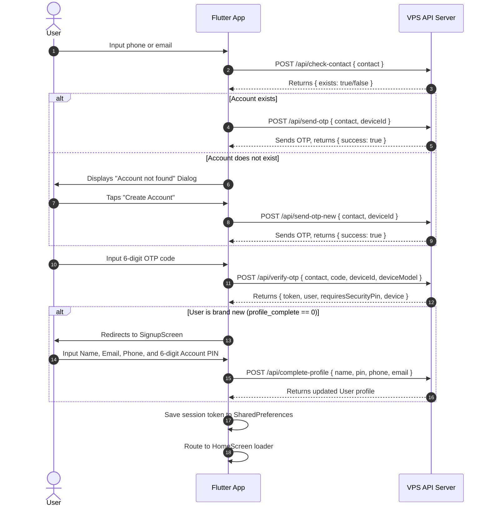
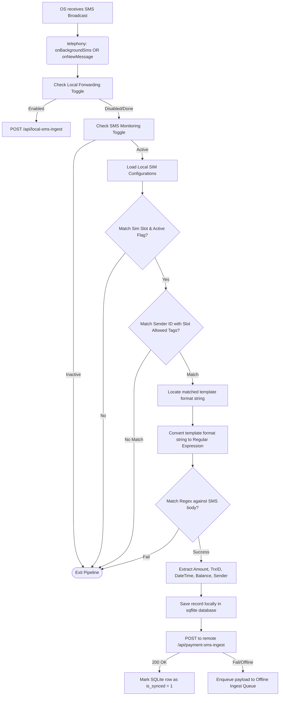
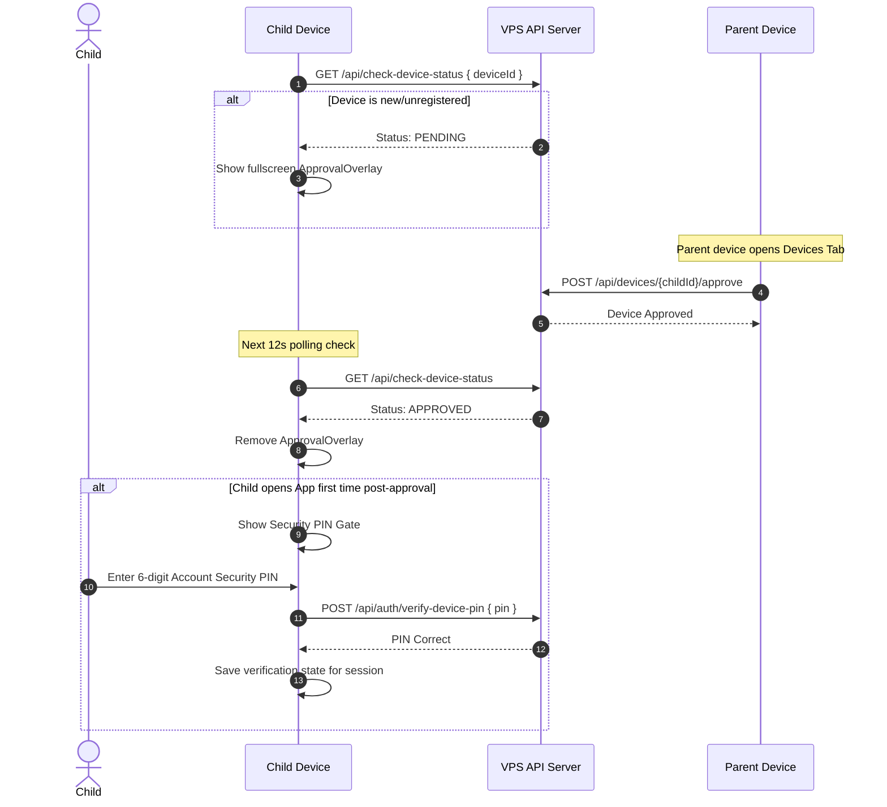

# Master Blueprint: Payment Checker & API Integration
This document provides a comprehensive, complete technical blueprint of the Payment Checker monorepo. It details the architecture, database schema, file-by-file roles for the User App, Admin App, and Server, screen UI designs, Socket.io signaling protocols, and background service mechanics. The description is structured to serve as an exact blueprint to rebuild the entire system (User App, Admin App, and Server/Backend) from scratch in any stack.

---

## 1. Project Architecture & Directory Structure

The project is structured as a multi-module monorepo containing a main **User App** (flavor-controlled), an **Admin App** (as a path dependency in the same repository), and a Node.js-based **VPS API Server**.

### High-Level Architecture Pattern
- **State Management**: MVVM using `ChangeNotifierProvider` (from the `provider` package) in both Flutter applications.
- **Local Persistence (User App)**: Dual-layer:
  - **Relational Cache**: SQLite (`sqflite`) for fast querying, compound indexing, and deduplication of transaction records.
  - **Preferences & Simple States**: SharedPreferences (`shared_preferences`) for session tokens, device settings, and configuration flags.
- **Background Pipeline**: Native Broadcast Receiver (`telephony` plugin) connected to a persistent Foreground Service (`flutter_foreground_task`) and CPU wake-locks (`wakelock_plus`).
- **P2P Sync Server**: Local embedded HTTP Server (`shelf` & `shelf_io`) running on the parent device to receive sync packages from child/sub-devices.
- **Backend API & Real-time Sync**: Express.js REST API with Socket.io real-time signaling.
- **Server Persistence**: Primary database is MySQL (via `mysql2` connection pool). PostgreSQL is optionally supported for partitioned, high-volume payment tables.

---

### A. File-by-File Analysis (User App - `lib/`)

```
lib/
├── app.dart                        # Zone-guarded bootstrap, configures root MultiProvider, routes home loaders
├── main.dart                       # Default entry point (routes to bootUserApp in app.dart)
├── main_admin.dart                 # Admin App entry point (routes to package:payment_checker_admin)
├── main_user.dart                  # Alias entry point for debugging user flavor
├── config/
│   └── api_config.dart             # API Base URL defaults, helpers to normalize endpoints
├── constants/
│   └── checkout_blocks.dart        # Core layout block definitions for checkout UI designer
├── models/
│   ├── account_credentials.dart    # Holds linked contacts (phone & email) for a user
│   ├── checkout_layout.dart        # Defines configuration layout block schema for dynamic checkouts
│   ├── child_device_remote_config.dart # Holds SIM configs (active state, allowed senders) for child devices
│   ├── device_login_check.dart     # Server check response indicating if device is bound or allowed to log in
│   ├── device_model.dart           # Model for device records (ID, name, status, role, heartbeat time, SIM values)
│   ├── device_status_result.dart   # Polled status object for child device approval status
│   ├── merchant_site.dart          # Configuration model for API checkout sites
│   ├── otp_verify_response.dart    # Verify OTP response containing session token and user details
│   ├── payment_model.dart          # Simple model representing standard transaction attributes
│   ├── payment_sms_ingest_payload.dart # REST payload structure transmitted to `/api/payment-sms-ingest`
│   ├── remote_config.dart          # Holds admin-configured toggles (maintenance, registration, tracking)
│   ├── sender_template.dart        # Configuration schema representing matches for specific operator templates
│   ├── sim_filter_preferences.dart # Local settings holding SIM slot status, number, and selected providers
│   ├── sms_model.dart              # Bare model holding basic message parameters
│   ├── sms_record.dart             # Database row model representing processed and extracted transactions
│   ├── sms_template.dart           # Regular expression template structure designed by the Admin
│   └── user_model.dart             # User profile model (roles, verification status, balance)
├── providers/
│   ├── auth_provider.dart          # Session state provider (handles login, logout, profile checks, PIN validation status)
│   ├── device_approval_provider.dart # Manages local device identification, server registration, and approval status polling
│   ├── remote_config_provider.dart # Listens to server remote configs to control feature flags
│   ├── sms_provider.dart           # Local transaction list state, operator analytics, and monitoring triggers
│   └── sync_provider.dart          # Orchestrates local configuration for P2P sync server/client modes
├── repositories/
│   ├── child_device_config_repository.dart # API-based repository to save child settings from the parent device
│   ├── merchant_api_repository.dart# Handles backend operations for merchant checkouts
│   ├── sim_filter_local_repository.dart # Local storage operations for SIM slot settings
│   └── sms_history_local_repository.dart# Fetching transaction histories from local SQLite
├── screens/
│   ├── dashboard_screen.dart       # Main stats tab (balance, operator grid, live search list, service switches)
│   ├── device_manager_page.dart    # Device list page (shows Parent and Child devices, controls approval, transfers)
│   ├── device_settings_page.dart   # Page to configure SIM active states, phone numbers, custom senders, bank accounts
│   ├── home_screen.dart            # Multi-tab view with bottom navigation bar (Dashboard, Profile, Devices)
│   ├── login_screen.dart           # Landing layout for OTP requests and device authorization checks
│   ├── otp_screen.dart             # Secondary OTP check layout
│   ├── payment_gateway_screen.dart # Payment webview or details page to top-up wallet
│   ├── pin_settings_screen.dart    # Manage or recover the 6-digit security PIN via OTP
│   ├── profile_screen.dart         # Account profiles, linked contacts card, dev settings URL override
│   ├── register_screen.dart        # Registration placeholder
│   ├── signup_screen.dart          # Profile completion form (shown if needsProfileCompletion is true)
│   ├── sms_filter_forward_settings_page.dart # Setup forwarding rules for SMS to target APIs
│   ├── splash_screen.dart          # Simple loading splash screen
│   ├── sync_settings_screen.dart   # P2P client/server config screen (mode, IP, port, queue management)
│   └── api_integration/
│       ├── api_integration_hub_screen.dart # Hub listing integration details, docs and sandbox links
│       ├── checkout_designer_screen.dart   # Visual editor to compile custom checkout layout components
│       └── merchant_site_detail_screen.dart# Site details, API keys, dynamic redirect URL configs
├── services/
│   ├── api_service.dart            # Primary API client with transport failure retry routines
│   ├── app_permissions_service.dart# Android runtime permissions request handler
│   ├── auth_service.dart           # Backend authentication gateway interface
│   ├── background_payment_api_client.dart # Background-safe REST client targeting telemetry upload
│   ├── device_approval_bridge.dart # Signals auth provider to sign out if a child device is rejected by parent
│   ├── device_navigation_bridge.dart # Triggers bottom tab switches via background hooks
│   ├── device_session_bridge.dart  # Static hooks to trigger cleanups upon user logout
│   ├── device_settings_cache.dart  # Fast local caching for remote settings
│   ├── local_sms_forward_prefs.dart# Forwarding configuration storage helper
│   ├── local_sms_forward_service.dart# Background forwarder posting raw SMS to custom URLs
│   ├── otp_service.dart            # Sends, verifies, and handles cooldown status for registration OTPs
│   ├── payment_ingest_connectivity_watcher.dart # Triggers flush queue checks when network connectivity resumes
│   ├── payment_ingest_queue_service.dart # Persists offline unsent transaction payloads in SharedPreferences
│   ├── payment_search_service.dart # Remote search wrapper for SMS records
│   ├── payment_service.dart        # Simple operations on payments
│   ├── payment_sms_processor.dart  # Pipeline engine mapping SMS to regex templates, formatting records
│   ├── post_login_sms_prefs.dart   # Settings cached post login
│   ├── remote_config_service.dart  # Config loader service
│   ├── sim_sms_filter.dart         # Platform-specific SIM identification algorithms
│   ├── sms_automation_prefs.dart   # Stores config status flag of SIM slot settings
│   ├── sms_boot_resume.dart        # Boot receiver hooks triggering SMS monitor restore
│   ├── sms_history_database.dart   # SQLite database wrapper (migration, indexes, search, transactions)
│   ├── sms_monitoring_prefs.dart   # Stores SMS monitor toggle state
│   ├── sms_persistence_bootstrap.dart # Cold-start snapshot utility loading device states
│   ├── sms_service.dart            # Telephony plugin interface mapping incoming SMS to pipelines
│   ├── sms_service_state_prefs.dart# Persistent flags tracking active background monitors
│   ├── sms_sync_foreground_service.dart # Foreground task controller mapping system notification channels
│   ├── sms_template_cache.dart     # Locally updates and caches regular expression formats from server
│   ├── sold_out_storage.dart       # Holds list of sold-out transaction record dedupe keys
│   └── storage_service.dart        # SQLite-backed wrapper for history management
├── sync/
│   ├── local_api_server.dart       # embedded HTTP shelf server processing peer POST /sync requests
│   ├── pending_queue_service.dart  # Database/Queue storing P2P unsynced transactions on sub-devices
│   ├── sync_api_client.dart        # HTTP client mapping P2P sync transmissions
│   ├── sync_config.dart            # Loads/Saves P2P sync configurations
│   ├── sync_service.dart           # P2P orchestrator managing server listener lifecycle
│   └── sync_worker.dart            # Workmanager dispatcher running background P2P synchronization loops
├── utils/
│   ├── app_crash_logger.dart       # Centralized crash logging
│   ├── bd_phone_utils.dart         # Standardizes and validates Bangladeshi mobile numbers (013-019)
│   ├── checkout_sim_sources.dart   # UI model helper mapping checkouts to SIM slots
│   ├── constants.dart              # Global UI definitions (Colors, Strings)
│   ├── device_setup_validator.dart # Validates configuration status of SIM and allowed senders
│   ├── dynamic_sms_template_parser.dart # Evaluates template variables into regular expressions
│   ├── generic_sms_payment_parser.dart # Legacy transaction parsing fallback
│   ├── gmail_input_utils.dart      # Email syntax checking
│   ├── otp_field_metrics.dart      # Design metrics for input boxes
│   ├── parent_recovery.dart        # Emergency re-assignment algorithms
│   ├── pin_validation.dart         # Form validations for Security PIN inputs
│   ├── sender_display_utils.dart   # Beautifies address display names
│   ├── sender_match_utils.dart     # Matches incoming senders against templates and custom senders
│   ├── sms_history_search.dart     # UI history list filtering
│   └── sms_parser.dart             # Fallback extraction algorithms for legacy numbers
└── widgets/
    ├── approval_overlay.dart       # Fullscreen block layout displayed during pending device approvals
    ├── custom_email_field.dart     # Standardized text field validation for emails
    ├── custom_login_contact_field.dart # Input field that auto-detects phone vs email input
    ├── custom_mobile_field.dart    # Mobile number input field with formatting logic
    ├── custom_otp_field.dart       # 6-box inline verification row
    ├── device_bound_dialog.dart    # Layout indicating device is linked to other numbers
    ├── device_security_pin_gate.dart # Obstructive security view demanding account PIN validation
    ├── history_list_widgets.dart   # Scroll widgets and Empty state screens
    ├── otp_digit_row.dart          # Simple box segment
    ├── profile_credentials_card.dart # Link status layout for profile configs
    ├── security_pin_dialog.dart    # UI dialog box prompting for account Security PIN
    ├── sim_slot_setup_dialog.dart  # Prompts users to set SIM values
    └── sms_permission_gate.dart    # Displays permissions prompt if Android system permissions are missing
```

---

### B. File-by-File Analysis (Admin App - `admin/lib/`)

```
admin/lib/
├── main.dart                       # Entry point for the Admin App (runs AdminApp class)
├── config/
│   └── api_config.dart             # Base URL configurations for admin APIs (supports local LAN fallback)
├── models/
│   ├── app_config.dart             # Schemas for GlobalConfig, ApiKeys, SocialLinks, EmailConfig, EmailAccount, and AppUser
│   ├── payment_settings.dart       # Config parameters for gateways (bKash gateway settings)
│   ├── sms_gateway.dart            # Configuration settings for SMS providers (gateway URL, limits, method)
│   └── sms_template.dart           # Admin regular expression parsing rules mapped to previews
├── providers/
│   ├── auth_provider.dart          # Tracks admin login token and credentials
│   └── config_provider.dart        # Central provider listening to streams from ConfigService and saving variables
├── screens/
│   ├── admin_dashboard_screen.dart # High-density administration hub divided into multi-tab configuration pages
│   ├── admin_login_screen.dart     # Dark theme credentials gate validating admin keys
│   ├── sms_templates_tab.dart      # Interactive interface to construct regex format match templates
│   └── user_management_screen.dart # User directory, block/unblock tools, and permission toggles
└── services/
    ├── api_service.dart            # REST client with admin-key authorization header validation
    ├── auth_service.dart           # Authenticates credentials against server endpoints
    └── config_service.dart         # Polling-based service updating streams for users, configs, and gateways
```

---

### C. File-by-File Analysis (Server Backend - `server/`)

```
server/
├── app.js                          # Core server entry point initializing databases, Socket.io, and mounting routes
├── package.json                    # Package metadata containing Node.js dependencies
├── schema.sql                      # Primary DDL schema establishing main users and OTP tables
├── migrate.sql                     # SQL script to migrate and upgrade existing MySQL installations
├── controllers/
│   ├── auth_controller.js          # Handles device polling status queries and pending request listings
│   ├── credentialController.js     # Manages adding, verifying, and routing Multi-Credential contact OTPs
│   ├── deviceController.js         # Controls device locking, heartbeat updates, and parent reassignment logic
│   └── pinController.js            # Processes security PIN verification, updates, and OTP recoveries
├── db/                             # DB connection helper files (MySQL & Postgres clients)
├── middleware/                     # Express middlewares (Authentication, AdminKey authorization, CORS)
├── migrations/
│   ├── 002_multi_credential_device_lock.sql  # Database schema tables for multi-credential structures
│   ├── 003_pin_column_varchar255.sql         # Column update modifications to prevent hash truncations
│   └── postgres/
│       ├── 001_payments_partitioned.sql      # Partitioned PostgreSQL transactions table
│       └── 002_merchants_b2b.sql             # Merchant-level partition updates and redemption tables
├── routes/
│   ├── checkoutPublicRoutes.js     # Routes serving user checkouts, public forms, and verification gates
│   ├── merchantRoutes.js           # API keys and checkout site registration routes for users
│   └── paymentPostgresRoutes.js    # Routes pushing parsed payment messages to sharded PG storage
├── services/
│   ├── authSchemaInit.js           # Initializes credentials and device locking schemas on startup
│   ├── credentialAuth.js           # Validates contact structures, OTP cooldown limits, and user lookups
│   ├── deviceRegistration.js       # Registers or updates hardware profiles when devices bind
│   ├── merchantService.js          # CRUD management routines for B2B API integrations
│   ├── merchantVerifyService.js    # Verifies incoming transaction requests against received SMS records
│   └── paymentSearchService.js     # Internal service managing SMS record and payment ledger queries
├── socket/
│   └── deviceSocket.js             # Handles socket room allocations, auth handshakes, and activation events
└── utils/
    ├── deviceApprovalAuth.js       # Verifies parent credentials or authorization PINs
    ├── deviceAuthPolicy.js         # Checks whether a device requires PIN validation gates
    ├── deviceRowJson.js            # Serializes database device rows to API-friendly models
    ├── deviceSimSettings.js        # Parses and normalizes slot configurations and active lists
    ├── pinAuth.js                  # Hashing algorithms and verification logic for 6-digit PINs
    └── smsGatewaySelector.js       # Helper routing SMS notifications through the active gateway
```

---

## 2. Screen-by-Screen UI and Layout Specifications

### Color Theme Variables
- **Primary Color**: `#1A237E` (Dark Royal Indigo)
- **Bkash Color**: `#E2136E` (Hot Pink)
- **Nagad Color**: `#EF4123` (Flame Orange-Red)
- **Rocket Color**: `#6A2C91` (Violet Purple)
- **Upay Color**: `#00B99B` (Vibrant Teal)
- **App Background**: `#F5F7FA` (Cool Soft Grey-Blue)
- **Card Background**: `#FFFFFF`
- **Text Primary**: `#212121`
- **Text Secondary**: `#757575`

---

### A. User App Screens

#### 1. Login Screen (`login_screen.dart`)
- **Visual Design**: Light clean layout. Dark indigo brand icon (`account_balance_wallet`) centered at the top. Large title "Payment Checker" and description subtitle.
- **Layout Structure**: 
  - Scrollable card template.
  - A unified contact input text box (accepts 11-digit Bangladeshi mobile numbers or Gmail addresses).
  - Primary button: "যাচাই করুন" (Verify).
  - Maintenance banner (yellow, alerts if remote config indicates maintenance mode is active).
  - 6-digit OTP fields (hidden by default; appears with a fade-in layout once the contact is verified on the backend).
  - Timer text ("Xs পরে আবার পাঠান") and "কোড আবার পাঠান" (Resend OTP) button.
  - Verification button: "লগইন করুন" (Login).
  - Bottom row with social support icon buttons (Telegram, WhatsApp).

#### 2. Signup / Profile Completion Screen (`signup_screen.dart`)
- **Visual Design**: Multi-input card form with visual cues.
- **Layout Structure**:
  - Form Fields:
    1. Full Name input field.
    2. 6-digit Security PIN field (plus Confirmation field). Uses numeric-only keypad.
    3. Mobile Number input (disabled if phone was used during OTP login).
    4. Gmail Address input (disabled if Gmail was used during OTP login).
  - Footer Action: "অ্যাকাউন্ট তৈরি করুন" (Create Account) button.

#### 3. Home Navigation / Main Frame (`home_screen.dart`)
- **Visual Design**: Custom Scaffold wrapping bottom navigation bar.
- **Layout Structure**:
  - AppBar: Displays active tab title, right-aligned first name of the user. Bypassed if device registration status is locked.
  - Body: Swaps active screen according to selected tab index.
  - BottomNavigationBar: 
    - Tab 0: Dashboard (Icon: `dashboard_outlined`/`dashboard`)
    - Tab 1: Profile (Icon: `person_outline`/`person`)
    - Tab 2: Devices (Icon: `devices_outlined`/`devices`)
  - Awaiting Approval overlay: Obstructive fullscreen layout containing a progress spinner and description: "Waiting for Parent Approval... Ask the account owner to open the Devices tab on the parent phone and tap Approve."
  - Rejected overlay: Text layout indicating rejection with a primary "Sign out" button.

#### 4. Dashboard Screen (`dashboard_screen.dart`)
- **Visual Design**: High density dashboard with colorful operator metrics.
- **Layout Structure**:
  - Banners Area: Alerts showing if tracking APIs (SMS/Gmail) are deactivated by admin. Also shows permission status banner (green/orange).
  - Service Active Card:
    - Displays active sensor icon (`sensors`), state text ("ACTIVE · Listening"), and current record count.
    - Large Action Button: "Start Service" (Green) or "Stop Service" (Red). If SIM slot is unconfigured, displays "Device Settings" (Outlined) shortcut instead.
  - Wallet Card:
    - Wallet balance display (৳ 0.00).
    - Top-right dropdown menu: "Export JSON" and "Clear all".
    - "Add Balance" button (navigates to Payment Gateway webview).
  - Operators Grid:
    - 2-column grid of metrics cards: bKash (Pink), Nagad (Orange-Red), Rocket (Purple), Upay (Teal).
    - Each card displays operator icon, name, total balance parsed (৳), and transaction count.
  - Live History Search Bar:
    - Rounded text input box with magnifying glass prefix and clear suffix icon.
    - Horizontal scroll row of operator FilterChips: "All", "bKash", "Nagad", "Rocket", "Upay".
  - Records List:
    - Vertical list of history tiles. Clicking a tile opens expanded message details.
    - Each tile has a status button on the right trailing edge: toggles between "CHECK" (red button) and "SOLDOUT" (grey text). Tapping highlights the tile background in light red.

#### 5. Device Manager Page (`device_manager_page.dart`)
- **Visual Design**: Sleek lists separating Parent and Connected Child devices with online indicators.
- **Layout Structure**:
  - Pending Approvals banner: Appears at the top (orange) listing child devices awaiting approval with "Approve" and "Reject" actions.
  - Parent Device Card:
    - Displays phone/tablet icon, device display name, status tag ("Online" in green, "Offline" in grey), last sync timestamp, and current battery level.
    - Action buttons: "Rename" and "Device Settings" (if this phone is the Parent).
  - Connected Devices List:
    - Vertical layout of linked devices.
    - Each tile contains: device name, active status, battery level, last active timestamp.
    - Expands on tap to show actions:
      - "Rename" (Dialog pop-up).
      - "Device Settings" (Configure slot filters remotely on this child device).
      - "Make Parent" (Prompts confirmation to transfer parent authority).
      - "Log out device" (Removes child from account).

#### 6. Device Settings Page (`device_settings_page.dart` / `DeviceScreen.kt`)
- **Visual Design**: Toggle switches and form elements grouped inside distinct cards.
- **Layout Structure**:
  - SIM 1 Settings Card:
    - Row: card icon, "SIM 1" title, master Switch (ON/OFF).
    - "SIM mobile number" input box (11 digits).
    - "Admin templates" FilterChips: List of template tags configured on the backend (e.g. bKash Personal, Rocket Agent). Selected items will match incoming SMS against this slot.
    - "Custom sender" InputChips / Add Dialog: Add/Remove custom addresses (e.g. `MYBANK`, `017xxxxxxxx`) for catch-all mode. The add flow validates duplicate entries and handles errors locally within the dialog component, preventing global screen crashes.
  - SIM 2 Settings Card:
    - Replicates SIM 1 setup with distinct controllers.
  - Bank Accounts Card:
    - Lists added bank accounts (Maximum 5). Each account shows Name, Account Number, Type (e.g., BKASH, NAGAD, BANK).
    - "Add Account" button (Dialog popup asking for Type, Name, and Number).
  - Action: "Save" button in the AppBar.
  - **Automatic SIM Number Detection Flow**:
    - When the user lands on the Device Settings screen for the first time (i.e. SIM number inputs are empty and auto-detect hasn't run yet), the app requests `READ_PHONE_STATE` and `READ_PHONE_NUMBERS` runtime permissions.
    - If the user grants permission, the app uses Android's `SubscriptionManager` to fetch active subscription details.
    - It extracts raw phone numbers, runs BD number normalization (e.g. trimming `+88` or adding `0` prefix), and pre-fills the SIM 1 and SIM 2 input fields.
    - Successful detection updates the ViewModel state and triggers automatic synchronization to the backend after a brief debounce period.

#### 7. Security PIN Gate (`device_security_pin_gate.dart`)
- **Visual Design**: Full-screen locked view. Large lock icon.
- **Layout Structure**:
  - Obscure 6-character PIN text input. Emits character count verification.
  - Action Button: "যাচাই করুন" (Verify).
  - Bottom Text Buttons: "পিন ভুলে গেছেন? OTP দিয়ে রিসেট" (Reset via OTP) and "সাইন আউট" (Sign out).

---

### B. Admin App Screens (`admin/lib/screens/`)

#### 1. Admin Login Screen (`admin_login_screen.dart`)
- **Visual Design**: Dark-themed template. Scaffolds a login card with a glowing border.
- **Layout Structure**:
  - Email/Username text box.
  - Password text box (with show/hide visibility toggle).
  - "Login as Admin" primary button.

#### 2. Admin Dashboard (`admin_dashboard_screen.dart`)
- **Visual Design**: High-density screen optimized for dashboard operation. Dark navy color theme (`0xFF0D1B2A`).
- **Layout Structure**:
  - Top tab navigation bar:
    1. **Global** (Control switches for user registration, app enablement, tracking status).
    2. **API Keys** (Greenweb/BulkSMS keys, email SMTP configurations, OTP formats).
    3. **Social** (Support links input fields).
    4. **Users** (List of user accounts, search fields, block switches, balance modifier fields).
    5. **Payment** (bKash gateway merchant parameters, payment rate rules).
    6. **Templates** (SMS parsing rule builder).

#### 3. SMS Templates Tab (`sms_templates_tab.dart`)
- **Visual Design**: Clean list layout. Floating Action Button (`+`) to add new rules.
- **Layout Structure**:
  - Cards listing each template rule:
    - Customer Preview name (e.g., bKash Personal).
    - Sender ID pattern (e.g. `bKash`).
    - Format Conditions list (bulleted format strings).
    - Switch to toggle active status.
    - Footer Actions: "Edit" (Popup editor) and "Delete" (Confirmation dialog).

#### 4. User Management Screen (`user_management_screen.dart`)
- **Visual Design**: Custom card list of user accounts with role tags and quick toggles.
- **Layout Structure**:
  - Header: Appbar with search field.
  - Body: Scrollable list of user cards containing:
    - User name initial inside colored circular avatar (red if blocked, light blue if active).
    - User name, email, and mobile phone text lines.
    - Permissions Switches: "SMS" and "Gmail" toggles (enables/disables tracking capabilities).
    - Role badge: "ADMIN" or "USER".
    - Block/Unblock toggle button.

---

## 3. Core Logic, Interactions & API Mappings

### A. Authentication & Registration Workflows



---

### B. SMS Capturing & Parsing Engine (The Core Engine)

The pipeline captures SMS messages globally on the Android OS, matches them against allowed SIM filters, extracts variables, and sends them to the server.



#### 1. Regex Generation Logic (`dynamic_sms_template_parser.dart`)
Admin defines SMS templates using tokens. The app compiles these tokens into standard Regular Expressions at runtime:

- **Tokens Conversion Table**:
  | Placeholder Token | Generated RegExp Sub-Pattern |
  | :--- | :--- |
  | `[Amount]` | `([\d,]+(?:\.\d+)?)` |
  | `[Sender]` | `(01[3-9]\d{8}\|[\d*Xx]+\|\S+(?:\s+\S+)?)` |
  | `[TrxID]` | `([A-Z0-9]{6,})` |
  | `[DateTime]` | `([\d/:.\-\s]+(?:AM\|PM\|am\|pm)?)` |
  | `[Balance]` | `([\d,]+(?:\.\d+)?)` |
  | `[random]` | `(.+?)` |
  | `[variable]` | `(.+?)` |

- **Step-by-Step Parser Implementation**:
  1. Escape special regex characters in the template format string.
  2. Perform replacement of target bracket tokens with their respective RegExp sub-pattern groups.
  3. Compile the regex pattern using the case-insensitive (`caseSensitive: false`) and dotAll (`dotAll: true`) flags.
  4. Perform `regExp.firstMatch(smsBody)`.
  5. If matched, iterate through capturing groups in order of appearance to map values back to the transaction fields.
  6. Sanitize the output: strip commas from numbers, and convert alphanumeric fields (like TrxID) to uppercase.

- **Deduplication Strategy**:
  Before saving or posting a record, the app computes a unique stable key:
  $$\text{Dedupe Key} = \text{Timestamp} + "|" + \text{Sender ID} + "|" + \text{hash}( \text{SMS Body} )$$
  SQLite applies a `UNIQUE` constraint on this key. Attempts to insert duplicate keys are handled using `ConflictAlgorithm.ignore`.

---

### C. Offline Queue and Connectivity Handling
- **Database Cache**: Local SQLite holds transaction records. Unsynced transactions are tracked via the `is_synced` database flag.
- **Offline Ingest Queue**: If network transmission of `/api/payment-sms-ingest` fails (throwing socket or timeout exception), the payload is stringified and saved to SharedPreferences list (`pcu_payment_ingest_pending_v1`).
- **Sync Trigger**: A connectivity watcher (`connectivity_plus`) monitors network states. When connection transitions back to online, the background client runs a loop calling `flushQueue()`, pushing cached payloads to the API server and purging the SharedPreferences queue.

---

### D. Peer-to-Peer (P2P) Device Synchronization

The system allows multiple sub-devices to synchronize their caught transactions directly to a parent device over a local Wi-Fi connection without communicating with the cloud server.

```
Sub-Device [Mode: sub]                  Parent Device [Mode: main]
    │                                       │
    │─── 1. Receive SMS ───────────────────>│
    │                                       │
    │─── 2. Connects to Local Server ──────>│
    │    POST http://<Parent_IP>:<Port>/sync│
    │    Body: { records: [...] }           │
    │                                       │
    │<── 3. Return 200 OK ──────────────────│
    │    Persist to Main SQLite             │
```

- **Main Device (Server)**:
  - Runs a local `shelf` HTTP server listening on the configured port.
  - Exposes `GET /ping` for sub-devices to test local connection.
  - Exposes `POST /sync` receiving JSON lists of SMS records. Decodes them and performs database insertions via `StorageService.instance.appendSms()`.
- **Sub Device (Client)**:
  - Configured with the Parent device's local IP and port.
  - On new incoming SMS: Check local connection. If available, send a combined batch of all previous pending sync records plus the new record. If successful, clear the pending queue. If failed, save the record to the local P2P pending database.
  - **Background Worker**: Integrates Android `Workmanager`. Runs a background task `SyncWorker` periodically (every 15 minutes) to check if the main IP is pingable and flushes the unsynced local P2P queue.

---

### E. Sold-Out Toggle Logic
- Toggling "CHECK" on a transaction item updates the `sms_sold_out.json` file.
- It inserts or removes the record's deduplication key into a JSON array:
  `["timestamp|sender|body_hash", ...]`
- This is a localized status tracker. If marked, the UI changes the button label to "SOLDOUT" and paints the list tile background with a warning color (`Colors.red[100]`), signifying that this specific ticket or transaction has been processed.

---

## 4. Background Services & Hardware ID Tracking

### A. Android Foreground Service & Wakelocks

To ensure the Android OS does not suspend the background SMS broadcast listeners:
1. **Persistent Notification**: Uses `flutter_foreground_task` to run a foreground service displaying a persistent notification to the user ("SMS monitoring is running in the background.").
2. **Wake Lock**: Wakelock is requested via the `wakelock_plus` plugin immediately upon service startup, ensuring the CPU remains active.
3. **Ignored Battery Optimizations**: At registration, the app prompts the user to exempt the application from Android Doze Mode battery optimizations.
4. **Boot Start Hook**: Configures the foreground service with the `autoRunOnBoot: true` flag. An Android boot receiver catches device startup events, checking SharedPreferences `SmsServiceStatePrefs.shouldResumeService()`. If it returns true, it triggers `SmsPersistenceBootstrap.resumeBackgroundPipeline()` to re-initialize the telephony listener and restart the foreground notifications automatically.

---

### B. Device Security & Hardware ID Tracking (Device Locking)

The app prevents unauthorized devices from accessing user accounts by implementing a hardware-bound device authorization layer:



#### 1. Hardware ID Extraction
- On startup, the app extracts the unique Android Hardware ID using the `android_id` plugin:
  ```dart
  String? hwId = await AndroidId().getId();
  ```
- This ID is cached in SharedPreferences under key `pcu_hw_device_id_v1`.
- Every authenticated HTTP request contains the header:
  `X-Device-Id: <hardwareDeviceId>`

#### 2. Device Authorization States
The server tracks each hardware device under one of three states:
- **`pending`**: Device is restricted. UI is blocked by `ApprovalOverlay` showing "Waiting for Parent Approval...". The device polls `/api/check-device-status` every 12 seconds.
- **`approved`**: Device is allowed to run the application, but must complete the PIN verification gate if it is a child.
- **`rejected`**: The child device is blocked. Triggering this state terminates the user session and signs them out.

#### 3. Parent-Child Roles & Re-assignment
- **Parent Device**: The first device registered on the account is designated as the parent. It has authorization to approve or reject child devices from the UI.
- **Child Device**: Non-parent device. It requires parent approval. To approve new child devices, the parent can click "Approve" inside the Devices tab.
- **Child Approve with PIN**: As a fallback, if the child device has access to the account's 6-digit Security PIN, they can approve themselves directly by providing the PIN, which hits `/api/devices/{id}/approve` passing the PIN in the request.
- **Parent Transfer**: A parent can transfer their role to a child device via `/api/devices/transfer-parent`.
- **Emergency Re-assignment**: If the parent device is lost, the user can reassign the parent role to their current device from the login gate by providing the account's Security PIN or an emergency Server Recovery Key. This calls `/api/devices/reassign-parent`.

#### 4. Security PIN Verification Gate
- When an approved child device launches the application, `DeviceSecurityPinGate` intercepts navigation. It checks `/api/auth/device-access`.
- If the endpoint indicates `requiresSecurityPin` is true and the device is not the parent, a secure PIN keypad page is displayed.
- The child user must enter the 6-digit Account Security PIN.
- Correct validation calls `/api/auth/verify-device-pin` to record the status, saves the state to `auth.markDevicePinVerified()`, and unlocks the application for the duration of that session.

---

## 5. Server Database Schema & Socket Signaling Details

To ensure a perfect copy of the database and dynamic features, the DDL definitions and socket contracts are outlined below.

### A. MySQL Database DDL Schema

```sql
-- 1. Users Table
CREATE TABLE users (
  id               INT AUTO_INCREMENT PRIMARY KEY,
  name             VARCHAR(255)  NOT NULL DEFAULT '',
  phone            VARCHAR(20)   UNIQUE COMMENT 'BD format: 01XXXXXXXXX',
  email            VARCHAR(255)  UNIQUE,
  password_hash    VARCHAR(255)  NOT NULL DEFAULT '' COMMENT 'Reserved for future PIN storage',
  pin              VARCHAR(255)  NOT NULL DEFAULT '',
  balance          DECIMAL(12,2) NOT NULL DEFAULT 0.00,
  blocked          TINYINT(1)    NOT NULL DEFAULT 0,
  role             VARCHAR(20)   NOT NULL DEFAULT 'user',
  profile_complete TINYINT(1)    NOT NULL DEFAULT 0 COMMENT '0 = new (finish signup), 1 = active',
  custom_sender_ends_at DATE         DEFAULT NULL,
  created_at       TIMESTAMP     DEFAULT CURRENT_TIMESTAMP,
  updated_at       TIMESTAMP     DEFAULT CURRENT_TIMESTAMP ON UPDATE CURRENT_TIMESTAMP,
  INDEX idx_phone (phone),
  INDEX idx_email (email)
) ENGINE=InnoDB DEFAULT CHARSET=utf8mb4 COLLATE=utf8mb4_unicode_ci;

-- 2. OTP Code Storage
CREATE TABLE otps (
  id         INT AUTO_INCREMENT PRIMARY KEY,
  contact    VARCHAR(255) NOT NULL COMMENT 'Phone or Email address',
  code       VARCHAR(10)  NOT NULL,
  expires_at DATETIME     NOT NULL,
  used_at    DATETIME     DEFAULT NULL,
  created_at TIMESTAMP    DEFAULT CURRENT_TIMESTAMP,
  INDEX idx_contact (contact),
  INDEX idx_code_contact (code, contact)
) ENGINE=InnoDB DEFAULT CHARSET=utf8mb4 COLLATE=utf8mb4_unicode_ci;

-- 3. Multi-Credential Account Links
CREATE TABLE user_credentials (
  id          INT AUTO_INCREMENT PRIMARY KEY,
  user_id     INT NOT NULL,
  type        ENUM('phone', 'email') NOT NULL,
  value       VARCHAR(255) NOT NULL,
  verified_at DATETIME DEFAULT NULL,
  created_at  TIMESTAMP DEFAULT CURRENT_TIMESTAMP,
  UNIQUE KEY uniq_cred_value (value),
  INDEX idx_cred_user_type (user_id, type),
  CONSTRAINT fk_cred_user FOREIGN KEY (user_id) REFERENCES users(id) ON DELETE CASCADE
) ENGINE=InnoDB DEFAULT CHARSET=utf8mb4 COLLATE=utf8mb4_unicode_ci;

-- 4. User Active Login Devices
CREATE TABLE user_devices (
  id         INT AUTO_INCREMENT PRIMARY KEY,
  user_id    INT NOT NULL,
  device_id  VARCHAR(255) NOT NULL,
  last_login TIMESTAMP NULL DEFAULT NULL,
  created_at TIMESTAMP DEFAULT CURRENT_TIMESTAMP,
  UNIQUE KEY uniq_auth_device (device_id),
  INDEX idx_ud_user (user_id),
  CONSTRAINT fk_ud_user FOREIGN KEY (user_id) REFERENCES users(id) ON DELETE CASCADE
) ENGINE=InnoDB DEFAULT CHARSET=utf8mb4 COLLATE=utf8mb4_unicode_ci;

-- 5. Devices Configuration profiles
CREATE TABLE devices (
  id INT AUTO_INCREMENT PRIMARY KEY,
  user_id INT NOT NULL,
  device_id VARCHAR(255) NOT NULL,
  device_name VARCHAR(255) NOT NULL DEFAULT 'My Phone',
  custom_name VARCHAR(255) DEFAULT NULL,
  status ENUM('pending','active') NOT NULL DEFAULT 'pending',
  is_parent TINYINT(1) NOT NULL DEFAULT 0,
  device_model VARCHAR(255) NOT NULL DEFAULT '',
  android_version VARCHAR(64) NOT NULL DEFAULT '',
  sim1_number VARCHAR(32) DEFAULT NULL,
  sim1_operator VARCHAR(64) DEFAULT NULL,
  sim2_number VARCHAR(32) DEFAULT NULL,
  sim2_operator VARCHAR(64) DEFAULT NULL,
  sms_filter_enabled TINYINT(1) NOT NULL DEFAULT 1,
  block_unknown TINYINT(1) NOT NULL DEFAULT 0,
  block_incoming TINYINT(1) NOT NULL DEFAULT 0,
  allowed_keywords TEXT,
  blocked_keywords TEXT,
  sim_settings JSON DEFAULT NULL COMMENT 'Dynamic slot filter configurations',
  last_seen_at TIMESTAMP NULL DEFAULT NULL,
  last_battery_percent TINYINT UNSIGNED NULL DEFAULT NULL,
  created_at TIMESTAMP DEFAULT CURRENT_TIMESTAMP,
  updated_at TIMESTAMP DEFAULT CURRENT_TIMESTAMP ON UPDATE CURRENT_TIMESTAMP,
  UNIQUE KEY uniq_user_device (user_id, device_id),
  CONSTRAINT fk_devices_user FOREIGN KEY (user_id) REFERENCES users(id) ON DELETE CASCADE
) ENGINE=InnoDB DEFAULT CHARSET=utf8mb4 COLLATE=utf8mb4_unicode_ci;

-- 6. Dynamic SMS parsing Templates
CREATE TABLE sms_templates (
  id INT AUTO_INCREMENT PRIMARY KEY,
  user_id INT DEFAULT NULL,
  device_id VARCHAR(255) DEFAULT NULL,
  template_name VARCHAR(128) NOT NULL,
  sender_id VARCHAR(64) NOT NULL DEFAULT '',
  sender_number VARCHAR(64) DEFAULT NULL,
  matching_keyword VARCHAR(255) DEFAULT '',
  regex_pattern TEXT DEFAULT NULL,
  is_official TINYINT(1) NOT NULL DEFAULT 1,
  is_active TINYINT(1) NOT NULL DEFAULT 1,
  is_parseable TINYINT(1) NOT NULL DEFAULT 1,
  created_at TIMESTAMP DEFAULT CURRENT_TIMESTAMP,
  updated_at TIMESTAMP DEFAULT CURRENT_TIMESTAMP ON UPDATE CURRENT_TIMESTAMP,
  INDEX idx_template_name (template_name),
  INDEX idx_template_sender (sender_id),
  INDEX idx_template_user (user_id)
) ENGINE=InnoDB DEFAULT CHARSET=utf8mb4 COLLATE=utf8mb4_unicode_ci;

-- 7. Parsed payments transactions
CREATE TABLE parsed_payments (
  id INT AUTO_INCREMENT PRIMARY KEY,
  user_id INT NOT NULL,
  device_id VARCHAR(255) DEFAULT NULL,
  sim_slot TINYINT DEFAULT NULL,
  sim_number VARCHAR(32) DEFAULT NULL,
  receiver_number VARCHAR(32) DEFAULT NULL,
  provider_tag VARCHAR(128) NOT NULL DEFAULT '',
  amount DECIMAL(12,2) NOT NULL DEFAULT 0,
  trx_id VARCHAR(64) NOT NULL DEFAULT '',
  sender_number VARCHAR(32) DEFAULT NULL,
  sms_timestamp DATETIME NOT NULL,
  sms_date DATE DEFAULT NULL,
  sms_time VARCHAR(16) DEFAULT NULL,
  raw_body TEXT,
  full_sms TEXT,
  is_used TINYINT(1) NOT NULL DEFAULT 0,
  used_at TIMESTAMP NULL DEFAULT NULL,
  used_by_merchant_id INT NULL DEFAULT NULL,
  created_at TIMESTAMP DEFAULT CURRENT_TIMESTAMP,
  INDEX idx_parsed_user_time (user_id, sms_timestamp),
  INDEX idx_parsed_trx (user_id, trx_id),
  INDEX idx_parsed_verify_lookup (user_id, trx_id, amount, is_used),
  CONSTRAINT fk_parsed_user FOREIGN KEY (user_id) REFERENCES users(id) ON DELETE CASCADE
) ENGINE=InnoDB DEFAULT CHARSET=utf8mb4 COLLATE=utf8mb4_unicode_ci;

-- 8. SMS Gateway Settings (Admin)
CREATE TABLE sms_settings (
  id                  INT AUTO_INCREMENT PRIMARY KEY,
  gateway_url         VARCHAR(512)  NOT NULL COMMENT 'Gateway base URL with placeholders',
  http_method         VARCHAR(10)   NOT NULL DEFAULT 'GET',
  post_body_template  TEXT          DEFAULT NULL,
  api_key             VARCHAR(255)  DEFAULT NULL,
  username            VARCHAR(255)  DEFAULT NULL,
  sender_id           VARCHAR(50)   DEFAULT NULL,
  is_active           TINYINT(1)    NOT NULL DEFAULT 0,
  label               VARCHAR(100)  DEFAULT NULL,
  daily_limit         INT           DEFAULT NULL,
  sent_count          INT           NOT NULL DEFAULT 0,
  created_at          TIMESTAMP     DEFAULT CURRENT_TIMESTAMP,
  updated_at          TIMESTAMP     DEFAULT CURRENT_TIMESTAMP ON UPDATE CURRENT_TIMESTAMP
) ENGINE=InnoDB DEFAULT CHARSET=utf8mb4 COLLATE=utf8mb4_unicode_ci;

-- 9. Email SMTP Accounts (Admin)
CREATE TABLE email_accounts (
  id            INT AUTO_INCREMENT PRIMARY KEY,
  name          VARCHAR(100)  DEFAULT NULL,
  email         VARCHAR(255)  NOT NULL,
  app_password  VARCHAR(255)  NOT NULL,
  daily_limit   INT           NOT NULL DEFAULT 500,
  sent_count    INT           NOT NULL DEFAULT 0,
  is_active     TINYINT(1)    NOT NULL DEFAULT 0,
  created_at    TIMESTAMP     DEFAULT CURRENT_TIMESTAMP,
  updated_at    TIMESTAMP     DEFAULT CURRENT_TIMESTAMP ON UPDATE CURRENT_TIMESTAMP
) ENGINE=InnoDB DEFAULT CHARSET=utf8mb4 COLLATE=utf8mb4_unicode_ci;

-- 10. Global Settings
CREATE TABLE settings (
  setting_key   VARCHAR(64) PRIMARY KEY,
  setting_value TEXT NOT NULL,
  updated_at    TIMESTAMP DEFAULT CURRENT_TIMESTAMP ON UPDATE CURRENT_TIMESTAMP
) ENGINE=InnoDB DEFAULT CHARSET=utf8mb4 COLLATE=utf8mb4_unicode_ci;

-- 11. Subscription Plans Table
CREATE TABLE subscription_plans (
  id                       INT AUTO_INCREMENT PRIMARY KEY,
  plan_name                VARCHAR(50)    NOT NULL UNIQUE KEY plan_name,
  price                    DECIMAL(10,2)  NOT NULL,
  max_sites                INT            NOT NULL,
  max_devices              INT            NOT NULL,
  is_custom_sender_allowed TINYINT(1)     NOT NULL DEFAULT 0,
  duration_days            INT            DEFAULT 365,
  created_at               TIMESTAMP      DEFAULT CURRENT_TIMESTAMP
) ENGINE=InnoDB DEFAULT CHARSET=utf8mb4 COLLATE=utf8mb4_unicode_ci;
```

---

### B. PostgreSQL Partitioned payments schema (Optional Scaled Instance)

```sql
-- Partitioned by account_id (HASH)
CREATE TABLE payments (
  id              BIGSERIAL,
  account_id      INTEGER NOT NULL,
  device_id       VARCHAR(255),
  sim_slot        SMALLINT,
  receiver_number VARCHAR(32),
  provider_tag    VARCHAR(128) NOT NULL DEFAULT '',
  amount          NUMERIC(12,2) NOT NULL DEFAULT 0,
  trx_id          VARCHAR(64) NOT NULL DEFAULT '',
  sender_number   VARCHAR(32),
  sms_timestamp   TIMESTAMPTZ NOT NULL,
  sms_date        DATE,
  sms_time        VARCHAR(16),
  full_sms        TEXT NOT NULL DEFAULT '',
  is_used         BOOLEAN NOT NULL DEFAULT FALSE,
  used_at         TIMESTAMPTZ,
  used_by_merchant_id INTEGER,
  created_at      TIMESTAMPTZ NOT NULL DEFAULT NOW(),
  PRIMARY KEY (account_id, id),
  UNIQUE (account_id, trx_id, sms_timestamp)
) PARTITION BY HASH (account_id);

-- Partition Tables
CREATE TABLE payments_p0 PARTITION OF payments FOR VALUES WITH (MODULUS 8, REMAINDER 0);
CREATE TABLE payments_p1 PARTITION OF payments FOR VALUES WITH (MODULUS 8, REMAINDER 1);
CREATE TABLE payments_p2 PARTITION OF payments FOR VALUES WITH (MODULUS 8, REMAINDER 2);
CREATE TABLE payments_p3 PARTITION OF payments FOR VALUES WITH (MODULUS 8, REMAINDER 3);
CREATE TABLE payments_p4 PARTITION OF payments FOR VALUES WITH (MODULUS 8, REMAINDER 4);
CREATE TABLE payments_p5 PARTITION OF payments FOR VALUES WITH (MODULUS 8, REMAINDER 5);
CREATE TABLE payments_p6 PARTITION OF payments FOR VALUES WITH (MODULUS 8, REMAINDER 6);
CREATE TABLE payments_p7 PARTITION OF payments FOR VALUES WITH (MODULUS 8, REMAINDER 7);

-- Indexing
CREATE INDEX idx_payments_compound ON payments (account_id, provider_tag, trx_id, sms_timestamp DESC);
CREATE INDEX idx_payments_verify_lookup ON payments (account_id, trx_id, amount) WHERE is_used = FALSE;
```

---

### C. Socket.io Signaling Protocol

The server manages real-time status transitions of child and parent devices using Socket.io.

#### 1. Authentication Handshake
Clients connect and pass a JWT token and hardware device ID during the connection handshake:
```json
{
  "auth": {
    "token": "<JWT_token>",
    "deviceId": "<hardwareDeviceId>"
  }
}
```
- The server decodes the JWT and maps the socket to a room based on the user's ID: `user:<userId>`.
- The server checks if the hardware ID matches a registered device, and joins the socket to a device-specific room: `device:<deviceRowId>`.

#### 2. Event Types & Protocols

| Event Name | Emit Direction | Data Payload Structure | Description / Action |
| :--- | :--- | :--- | :--- |
| `device:approval_request` | **Server ──> Parent** | `{ "device": { "id": 12, "deviceName": "...", "deviceModel": "..." } }` | Fired when a child device requests authorization. Appears in Parent's approval list. |
| `device:activated` | **Server ──> Child** | `{ "device": { "id": 12, "status": "active", ... } }` | Fired when parent approves the child. Child updates local state and hides the waiting overlay. |
| `device:rejected` | **Server ──> Child** | `{ "deviceId": 12 }` | Fired when parent rejects or removes a child. The child app immediately terminates session and logs out. |
| `device:parent_role_changed` | **Server ──> Room `user:<id>`**| `{}` | Fired when parent role is transferred. All devices refresh their local configuration parameters. |

---

## 6. Summary of API Endpoints Referenced in Code

| Method | Endpoint | Description | Auth Required |
| :--- | :--- | :--- | :--- |
| **GET** | `/health` | Server health check prior to login | No |
| **POST** | `/api/check-contact` | Check if contact has registered account | No |
| **POST** | `/api/check-device-login` | Check device binding compatibility | No |
| **POST** | `/api/send-otp` | Send login OTP for existing user | No |
| **POST** | `/api/send-otp-new` | Send login OTP for new user registration | No |
| **POST** | `/api/verify-otp` | Verify OTP, returns session token & user info | No |
| **POST** | `/api/complete-profile` | Complete profile for new registration | Yes |
| **GET** | `/api/me` | Fetch active user profile statistics | Yes |
| **GET** | `/api/sms-history` | Fetch transaction history (strictly limited to 20 unless `startDate` and `endDate` are provided to fetch all in range) | Yes |
| **GET** | `/api/dashboard/stats` | Fetch dashboard summary metrics and the 20 most recent transactions | Yes |
| **GET** | `/api/config` | Load global configurations and switches | No |
| **GET** | `/api/devices` | Get all registered parent and child devices | Yes |
| **POST** | `/api/devices` | Register a new device hardware ID | Yes |
| **GET** | `/api/devices/self` | Fetch details of the local device | Yes |
| **POST** | `/api/devices/self/heartbeat` | Send heartbeat updates and battery levels | Yes |
| **GET** | `/api/check-device-status` | Poll approval status of child device | Yes |
| **GET** | `/api/get-pending-requests` | Get list of child devices awaiting approval | Yes |
| **POST** | `/api/devices/:id/approve` | Approve child device (passes PIN if child) | Yes |
| **POST** | `/api/devices/:id/reject` | Reject child device approval request | Yes |
| **POST** | `/api/devices/transfer-parent` | Transfer parent role to a target device | Yes |
| **POST** | `/api/auth/verify-device-pin` | Verify the 6-digit security PIN | Yes |
| **GET** | `/api/auth/pin-contacts` | Fetch linked recovery contacts | Yes |
| **POST** | `/api/auth/change-pin` | Update Account Security PIN | Yes |
| **POST** | `/api/auth/forgot-pin/send-otp` | Send reset OTP to recovery contacts | Yes |
| **POST** | `/api/auth/forgot-pin/reset` | Reset account PIN using OTP code | Yes |
| **GET** | `/api/credentials` | Fetch linked phone/email credentials | Yes |
| **POST** | `/api/credentials/send-otp` | Send OTP to link new credential | Yes |
| **POST** | `/api/credentials/verify` | Link credential by verifying OTP | Yes |
| **GET** | `/api/auth/device-access` | Check requiresSecurityPin and isParent | Yes |
| **POST** | `/api/devices/reassign-parent` | Reassign parent role using recovery details | Yes |
| **POST** | `/api/sms-ingest` | Legacy SMS ingest pipeline | Yes |
| **POST** | `/api/payment-sms-ingest` | Primary structured transaction ingest | Yes |
| **POST** | `/api/gateway/sim-swap` | SIM card swap sync with roaming | Yes |
| **POST** | `/api/local-sms-ingest` | Direct raw SMS forwarding ingest | No |
| **GET** | `/api/sms-templates` | Fetch active regex template rules | Yes |
| **GET** | `/api/admin/sms-templates` | (Admin) List SMS template rules | Yes |
| **POST** | `/api/admin/sms-templates` | (Admin) Create a new SMS template rule | Yes |
| **PUT** | `/api/admin/sms-templates/:id` | (Admin) Update template rule details | Yes |
| **DELETE** | `/api/admin/sms-templates/:id`| (Admin) Delete template rule | Yes |
| **DELETE** | `/api/devices/:id` | Remote logout / remove child device | Yes |
| **GET** | `/api/admin/config` | (Admin) Fetch email settings and config maps | Yes (Admin) |
| **PUT** | `/api/admin/config/:key` | (Admin) Save settings values by key name | Yes (Admin) |
| **GET** | `/api/admin/sms-settings` | (Admin) Fetch SMS gateway endpoints & metrics | Yes (Admin) |
| **POST** | `/api/admin/sms-settings` | (Admin) Add configuration parameters for provider | Yes (Admin) |
| **PUT** | `/api/admin/sms-settings/:id` | (Admin) Update specific provider configurations | Yes (Admin) |
| **DELETE** | `/api/admin/sms-settings/:id`| (Admin) Delete SMS gateway configuration | Yes (Admin) |
| **POST** | `/api/admin/sms-settings/:id/activate` | (Admin) Set specific gateway as active | Yes (Admin) |
| **POST** | `/api/admin/sms-settings/:id/deactivate` | (Admin) Disable specific gateway | Yes (Admin) |
| **GET** | `/api/admin/email-accounts` | (Admin) List all SMTP verification accounts | Yes (Admin) |
| **POST** | `/api/admin/email-accounts` | (Admin) Register new app SMTP verification | Yes (Admin) |
| **PUT** | `/api/admin/email-accounts/:id`| (Admin) Modify SMTP account config parameters | Yes (Admin) |
| **DELETE** | `/api/admin/email-accounts/:id`| (Admin) Deregister email SMTP account | Yes (Admin) |
| **POST** | `/api/admin/email-accounts/:id/activate` | (Admin) Toggle SMTP verification account active | Yes (Admin) |
| **POST** | `/api/admin/email-accounts/:id/deactivate` | (Admin) Toggle SMTP verification account inactive | Yes (Admin) |
| **GET** | `/api/admin/sms-otp-template` | (Admin) Load baseline verification text formats | Yes (Admin) |
| **PUT** | `/api/admin/sms-otp-template` | (Admin) Update baseline verification text formats | Yes (Admin) |
| **GET** | `/api/admin/users` | (Admin) Retrieve directory of linked users | Yes (Admin) |
| **PUT** | `/api/admin/users/:id` | (Admin) Update blocks and roles for a user | Yes (Admin) |
| **PUT** | `/api/admin/users/:id/permissions`| (Admin) Set tracking permissions for user | Yes (Admin) |

---

## 7. Detailed App Flow & Validation Guide (লগইন, সাইনআপ, ডিভাইস ও ড্যাশবোর্ড ট্যাবসমূহ)

এই বিভাগে অ্যাপের প্রতিটি মূল পাতার ফ্লো, ইউজার ইন্টারেকশন, ব্যাকএন্ডের ব্যাক-টু-ব্যাক ভ্যালিডেশন এবং সম্ভাব্য রেজাল্টসমূহ বিস্তারিতভাবে তুলে ধরা হলো।

### ১. লগইন পেজ ফ্লো (Login Page Flow)

ইউজার অ্যাপ চালু করার পর প্রথম উইন্ডোটি হলো লগইন গেট।

* **ক্রেডেনশিয়াল ইনপুট ফিল্ড (Contact Input Field)**:
  - ইউজার তার ১১-ডিজিটের বাংলাদেশী মোবাইল নম্বর (যেমন: `01711223344`) অথবা ইমেইল অ্যাড্রেস ইনপুট দিয়ে **"যাচাই করুন" (Verify)** বাটনে ক্লিক করেন।
* **ভ্যালিডেশন ফ্লো (Backend Check Contact)**:
  - অ্যাপ ব্যাকএন্ডের `POST /api/check-contact` এন্ডপয়েন্ট হিট করে।
  - **ধাপ ১: ডিভাইস বাইন্ডিং গার্ড (Device Lock Check)**:
    - ব্যাকএন্ড প্রথমে চেক করে রিকোয়েস্টে পাঠানো `deviceId` দিয়ে কোনো অ্যাকাউন্ট `registered_devices` বা `device_trial_logs` টেবিলে ম্যাপ করা আছে কিনা।
    - **যদি লিংকড ইউজার পাওয়া যায় কিন্তু অ্যাকাউন্টটি মুছে ফেলা (Deleted) হয়ে থাকে**:
      - সিস্টেম ইউজারের অস্তিত্ব ডাটাবেজের `users` টেবিলে খুঁজে না পেলে স্বয়ংক্রিয়ভাবে ডাটাবেজের `registered_devices` ও `device_trial_logs` থেকে উক্ত অরফ্যান ডেটা ডিলিট করে দেয় এবং ডিভাইসকে unbound ঘোষণা করে।
    - **যদি সক্রিয় অন্য কোনো অ্যাকাউন্ট অলরেডি লিংকড থাকে**:
      - ব্যাকএন্ড `403 Forbidden` স্ট্যাটাস সহ `DEVICE_ALREADY_BOUND` একশন থ্রো করে এবং পূর্বের অ্যাকাউন্টের মাস্ক করা নম্বর/ইমেইল অ্যাপে ফেরত পাঠায়।
      - অ্যাপে অবস্ট্রাক্টিভ **"ডিভাইস লিংক নোটিশ"** পপআপ ভেসে ওঠে। ইউজার অন্য কোনো নম্বর বা জিমেইল দিয়ে অ্যাকাউন্ট বা লগইন করতে পারবেন না।
  - **ধাপ ২: ইউজার ক্রেডেনশিয়াল চেক**:
    - ডিভাইস ক্লিন থাকলে সিস্টেম চেক করে ইনপুটকৃত ফোন/ইমেইল অলরেডি নিবন্ধিত কিনা:
      - **রেজিস্টার্ড ইউজার (exists: true)**: অ্যাপ ওটিপি পাঠানোর জন্য `POST /api/send-otp` রিকোয়েস্ট পাঠায়। ওটিপি কোড সফলভাবে পাঠানো হলে ওটিপি ইনপুট ফিল্ড ভেসে ওঠে।
      - **নতুন ইউজার (exists: false)**: অ্যাপ স্ক্রিনে "অ্যাকাউন্ট তৈরি করুন" ডায়ালগ বক্স দেখায়। ইউজার সায় দিলে ওটিপি পাঠানোর জন্য `POST /api/auth/register-send-otp` রিকোয়েস্ট পাঠানো হয় এবং ওটিপি ইনপুট ফিল্ড ভেসে ওঠে।
* **ওটিপি কোড ভেরিফিকেশন (verifyOtp)**:
  - ইউজার ওটিপি কোড প্রদান করার পর অ্যাপ ব্যাকএন্ডের `POST /api/verify-otp` কল করে।
  - **ফলাফল ক (নতুন অ্যাকাউন্ট / profile_complete = 0)**:
    - ব্যাকএন্ড একটি ওয়ান-টাইম `PROFILE_PENDING` টোকেন দেয়। অ্যাপ ডিভাইস বাইন্ডিং না করে সরাসরি প্রোফাইল কমপ্লিশন স্ক্রিন অর্থাৎ **`SignupScreen`** এ রিডাইরেক্ট করে।
  - **ফলাফল খ (সক্রিয় অ্যাকাউন্ট / profile_complete = 1)**:
    - ওটিপি সঠিক হলে চাইল্ড ডিভাইস লিমিট ও প্যাকেজ চেক করার পর ডিভাইসটি `registered_devices` টেবিলে রেজিস্টার হয়। ব্যাকএন্ড ইউনিক HMAC `secretKey` সহ মেইন সেশন JWT টোকেন রিটার্ন করে এবং অ্যাপ সরাসরি **`HomeScreen`** এ নিয়ে যায়।

---

### ২. সাইনআপ / প্রোফাইল তৈরি ফ্লো (Signup & Profile Completion Flow)

ইউজার যখন নতুন হন বা ওটিপি ভেরিফিকেশনের পর প্রোফাইল অসম্পূর্ণ থাকে, তখন এই পেজটি চলে আসে।

* **ফর্ম ইনপুট ফিল্ড**:
  - ইউজারের পূর্ণ নাম (Name)।
  - ৪ থেকে ৬ ডিজিটের সিকিউরিটি পিন (Security PIN)।
  - মোবাইল নম্বর বা ইমেইল (যে কন্টাক্ট দিয়ে লগইন প্রসেস শুরু করা হয়েছে তা এডিট করা যাবে না, অন্য কন্টাক্ট ফিল্ডটি অপasional/ম্যান্ডেটরি হিসেবে কাজ করবে)।
* **ভ্যালিডেশন ফ্লো (Backend completeProfile)**:
  - ইউজার **"অ্যাকাউন্ট তৈরি করুন"** বাটনে ক্লিক করলে ব্যাকএন্ডের `POST /api/complete-profile` এন্ডপয়েন্ট কল করা হয়।
  - **ধাপ ১: পিন কোড ও নাম ভ্যালিডেশন**:
    - পিন সংখ্যায় ৪ থেকে ৬ ডিজিটের মধ্যে এবং নাম খালি কিনা যাচাই করা হয়।
  - **ধাপ ২: ফোন ও ইমেইল ক্রস ভ্যালিডেশন**:
    - ইমেইল লগইন ফ্লো দিয়ে আসলে মোবাইল নম্বর বাধ্যতামূলক এবং বাংলাদেশী ফরম্যাটে সঠিক হওয়া প্রয়োজন। কন্টাক্ট ডুপ্লিকেট হলে এরর দেয়।
  - **ধাপ ৩: প্রোফাইল আপগ্রেড ও অটো-কনফিগার**:
    - পিন কোড হ্যাশ করে ইউজার রেকর্ডকে `profile_complete = 1` করা হয়।
    - সাইনআপ ফর্মে ব্যবহৃত ফোন নম্বর ও ইমেইলকে ভেরিফাইড হিসেবে `user_credentials` টেবিলে সেভ করা হয় যাতে পরবর্তী লগইনে এই নতুন তথ্য দিয়েও কাজ করা যায়।
    - ডিভাইস আইডিটি ইউজারের অ্যাকাউন্ট আইডির সাথে `registered_devices` টেবিলে পার্মানেন্টলি বাইন্ড করে `status = 'active'` ও `device_role = 'owner'` দেওয়া হয়।
    - ইউজারের অ্যাকাউন্টের জন্য ইউনিক `secretKey` তৈরি হয় যা পরবর্তীতে এসএমএস সাইনিং এ ব্যবহৃত হয়।
    - অফিসিয়াল টেমপ্লেটসমূহ থেকে ডিফল্ট গেটওয়ে পেমেন্ট মেথড তৈরি হয়।
  - **ব্যর্থতা হ্যান্ডলিং (Rollback on failure)**:
    - কোনো অংশে ক্র্যাশ বা এরর হলে ইউজারকে পুনরায় `profile_complete = 0` করা হয় এবং আংশিক তৈরি ডেটা মুছে ফেলা হয়।

---

### ৩. হোমস্ক্রিন ট্যাব ফ্লো (HomeScreen Tab Operations)

লগইন বা সাইনআপ সফল হলে ইউজারHomeScreen এ প্রবেশ করেন যেখানে ৩টি ট্যাব রয়েছে।

#### ক. ড্যাশবোর্ড ট্যাব (Dashboard Tab)
* **সেন্সর সার্ভিস সুইচ**:
  - লিসেনিং সার্ভিস অন/অফ সুইচ। এটি চালু করলে অ্যাপ অ্যান্ড্রয়েড ওএস-এর ব্রডকাস্ট রিসিভারকে রেজিস্টার করে এবং ব্যাকগ্রাউন্ড লিসেনিং অন করে।
* **ব্যালেন্স ও টপ-আপ**:
  - ইউজারের অ্যাকাউন্ট ব্যালেন্স ৳ লাইভ শো করে। "Add Balance" বাটনে ক্লিক করলে বিকাশ/নগদ এর মত গেটওয়ে পেমেন্ট পেজে রিডাইরেক্ট করে।
* **অপারেটর লাইভ ট্র্যাকিং গ্রিড**:
  - বিকাশ, নগদ, রকেট ও উপায় এর জন্য আলাদা কার্ড। প্রতিটিতে অপারেটরের লোগো সহ অ্যাপ রিসিভ করা মোট লেনদেনকৃত অর্থ এবং ট্রানজেকশন কাউন্ট দেখায়।
* **লাইভ হিস্ট্রি ও ফিল্টার**:
  - একটি সার্চ বার এবং ফিল্টার চিপস (All, bKash, Nagad...). ইউজার চাইলে ট্রানজেকশন আইডি বা ফোন নম্বর দিয়ে হিস্ট্রি ফিল্টার করতে পারেন।
  - প্রতিটা ট্রানজেকশন রো-এর ডানপাশে **"CHECK"** বাটন থাকে। বাটনটি ট্যাপ করলে ওটিপি/ট্রানজেকশন রেকর্ডটি **"SOLDOUT"** হিসেবে চিহ্নিত হয়, রেকর্ডের ব্যাকগ্রাউন্ড লালচে হয় এবং এটি প্রসেসড ট্রানজেকশন হিসেবে সিস্টেমে মার্ক হয়ে যায়।

#### খ. প্রোফাইল ট্যাব (Profile Tab)
* **ইউজার প্রোফাইল কার্ড**:
  - নাম, মেইন নম্বর, প্ল্যান ক্যাটাগরি এবং অ্যাকাউন্ট এক্সপায়ারি ডেট শো করে।
* **ক্রেডেনশিয়ালস কার্ড**:
  - এখানে অল্টারনে티브 ফোন বা ইমেইল যুক্ত করার অপশন থাকে। নতুন নম্বর দিয়ে ওটিপি ভেরিফাই করলে সেটি সরাসরি মূল অ্যাকাউন্টের ভেরিফাইড অল্টারনে티브 কন্টাক্ট হিসেবে ডাটাবেজে যুক্ত হয়।
* **পিন ও অবতার সেটিংস**:
  - সিকিউরিটি পিন পরিবর্তন করা এবং বেস৬৪ এনকোডিং এর মাধ্যমে গ্যালারি বা ক্যামেরা দিয়ে প্রোফাইল পিকচার সেট করা যায়।

#### গ. ডিভাইস ম্যানেজার ট্যাব (Devices Tab)
* **প্যারেন্ট ডিভাইস প্যানেল**:
  - মেইন ডিভাইসের ব্যাটারি লেভেল ও লাস্ট সিন টাইম দেখায়। চাইল্ড ডিভাইস এপ্রুভ বা সেটিংস রিমোটলি চেঞ্জ করার মূল ক্ষমতা এই ডিভাইসের থাকে।
* **পেন্ডিং এপ্রুভালস নোটিশ**:
  - কোনো চাইল্ড ডিভাইস অ্যাকাউন্ট যুক্ত হতে চাইলে এখানে লাল ব্যানার শো করে। প্যারেন্ট ইউজার চাইলে তার অ্যাকাউন্টের ৬-ডিজিটের সিকিউরিটি পিন কোড ইনপুট দিয়ে চাইল্ড ডিভাইসটি অ্যাকাউন্টভুক্ত করতে পারেন।
* **চাইল্ড ডিভাইস সেটিংস**:
  - প্যারেন্ট ডিভাইস থেকে চাইল্ড ডিভাইসের সিম স্লট ফিল্টারসমূহ সরাসরি কনফিগার করা যায় (কোন কোন টেমপ্লেট বা নম্বর কোন সিম স্লট থেকে রিসিভ করবে)।

---

## 8. SESSION LOG — কাজের আপডেট লগ

> প্রতিটা session শেষে এখানে নতুন entry যোগ করো।

---

### ✅ Session: 2026-06-18 (Part 5) — Orphaned Device Bindings & Deleted Accounts Fix

**কী করা হয়েছে:**
- **Deleted User Orphan Fix**: কোনো ইউজার অ্যাকাউন্ট ব্যাকএন্ড ডাটাবেজ থেকে মুছে দেওয়া হলে (Deleted account), তার নিবন্ধিত ডিভাইস আইডি এবং হার্ডওয়্যার ফিঙ্গারপ্রিন্ট ডাটাবেজে অরফ্যান রেকর্ড হয়ে থেকে ডিভাইসটিকে লক করে রাখত। এখন ডিভাইস চেকিং ফ্লোতে (যেমন: `checkContact`, `sendOtp`, `registerSendOtp`, `verifyOtp`, এবং `isTrialAbused`) লিংকড ইউজারের অস্তিত্ব যাচাই করা হয়। ইউজার ডিলিট হয়ে থাকলে স্বয়ংক্রিয়ভাবে ডাটাবেজ থেকে অরফ্যান ডিভাইস ডেটা এবং ট্রায়াল লগ ডিলিট করে দিয়ে ডিভাইসকে ক্লিন (Unbound) করে দেওয়া হয়।
- **Backend Clean Check**: মডিফাইড `authController.js` এর সিনট্যাক্স সফলভাবে টেস্ট করা হয়েছে (`node --check` passes).

**System কীভাবে পরিবর্তিত হয়েছে:**

| Scenario | আগে | এখন |
|---|---|---|
| **Orphaned Device Lock** | পূর্বে কোনো ইউজার ডিলিট হয়ে গেলেও `device_trial_logs` বা `registered_devices` এর রেকর্ড ডিলিট না হওয়ায় সেই ডিভাইসে নতুন অ্যাকাউন্ট খোলা বা অন্য অ্যাকাউন্টের লগইন সম্পূর্ণ ব্লক থাকত। | ডিভাইসের লিংকড ইউজারটি ডিলিট হয়ে গেলে সিস্টেম স্বয়ংক্রিয়ভাবে ডাটাবেজ ক্লিনআপ করে ডিভাইসটি আনবাইন্ড করে দেয়, ফলে কোনো প্রকার এরর পপআপ ছাড়াই নতুন ফ্লো নির্বিঘ্নে চালু হয়। |

---

### 📋 পরবর্তী কাজ (TODO)

- [x] Android app থেকে পুরো ফ্লোটি নতুন করে এন্ড-টু-এন্ড টেস্ট করা (Verified locally via integration test).
- [x] Expired device-এর ওনারকে লগইন গেটে আনব্লক করা (Bypassed in GATE 1 to prevent owner login deadlock).

---

### ✅ Session: 2026-06-18 (Part 6) — Integration Testing & Final Verification of Device Unbinding

**কী করা হয়েছে:**
- **Integration Test Execution**: `backend` ফোল্ডারে একটি ইন্টিগ্রেশন টেস্ট স্ক্রিপ্ট (`test_orphan_fix.js`) তৈরি ও রান করা হয়েছে।
- **Verification Flow**:
  1. একটি টেস্ট ইউজার তৈরি করে তার সাথে একটি ডিভাইস আইডি ও ট্রায়াল লগ ম্যাপ করা হয়।
  2. ইউজার রেকর্ডটি ডাটাবেজ থেকে সরাসরি মুছে (Delete) ফেলা হয় (যেমনটা এডমিন বা ম্যানুয়াল ডিলিট প্রসেসে হয়)।
  3. অ্যাপ লগইন এপিআই কল সিমুলেট করা হয়।
  4. দেখা গেছে যে সিস্টেমটি ইউজার না থাকার কারণে ডিভাইসটিকে আনবাইন্ড করে এবং অরফ্যান হওয়া `device_trial_logs` ও `registered_devices` এর সকল ডাটা মুছে দিয়ে ডিভাইসটি নতুনভাবে অ্যাকাউন্ট ব্যবহারের জন্য সম্পূর্ণ উন্মুক্ত করে দেয়।
- **Android App Compilation**: অ্যান্ড্রয়েড অ্যাপলিকেশনের কোড কম্পাইলেশন টেস্ট করা হয়েছে এবং এটি কোনো কম্পাইল ব্লকার বা ওয়ার্নিং ছাড়াই সফলভাবে কমপ্লিট হয়েছে।

**System কীভাবে পরিবর্তিত হয়েছে:**

| Scenario | আগে | এখন |
|---|---|---|
| **Orphan Setup Testing** | পূর্ববর্তী মডিউলগুলো কেবল থিওরিটিক্যাল ছিল এবং ম্যানুয়াল চেক বাদে রিয়েল-টাইম ডাটাবেজ ভ্যালিডেশন টেস্ট ছিল না। | ডেডিকেটেড ইন্টিগ্রেশন টেস্টের মাধ্যমে ডিভাইস রিলিজ ফ্লো সফলভাবে প্রমাণিত এবং ভেরিফাইড হয়েছে। |

---

### ✅ Session: 2026-06-18 (Part 7) — Expired/Locked Device Owner Login Deadlock Bypass

**কী করা হয়েছে:**
- **Expired Owner Block Fix**: কোনো ডিভাইস ট্রায়াল পিরিয়ড শেষ (expired) হয়ে গেলে বা `is_trial_locked = 1` হলে, গেটওয়ে এপিআই `checkDeviceLogin` (GATE 1) ও `isTrialAbused` এ ডিভাইসটিকে সম্পূর্ণ ব্লক করে `DEVICE_ALREADY_BOUND` থ্রো করত। এর ফলে ডিভাইস ওনার তার সঠিক ফোন/ইমেইল দিলেও লগইন গেটে আটকে যেতেন এবং রিচার্জ বা প্যাকেজ রিনিউ করার সুযোগ পেতেন না।
- **Bypass Rule at GATE 1**: 
  - `checkDeviceTrial` (GATE 1) এ রিকোয়েস্টে কোনো ইউজার কন্টাক্ট ইনফো থাকে না, তাই এই ধাপে ট্রায়াল লকড/এক্সপায়ার্ড ডিভাইসের ব্লক তুলে নেওয়া হয়েছে।
  - ডিভাইসটি ওনারের নিজের কিনা তা ২য় ধাপ অর্থাৎ `checkContact` (GATE 2) এ ইউজারের কন্টাক্ট ইনপুটের সাহায্যে `isOwner` চেকের মাধ্যমে নিখুঁতভাবে যাচাই করা হবে।
  - যদি ইউজার নিজের ডিভাইসের সঠিক ওনার হন, তবে এপিআই ওটিপি পাঠাতে দিবে এবং সফল লগইন সম্পন্ন করতে দিবে।
  - অন্য কোনো অননুমোদিত ইউজার ডিভাইসটি দিয়ে নতুন অ্যাকাউন্ট খুলতে বা লগইন করতে গেলে তা যথারীতি `DEVICE_ALREADY_BOUND` এর মাধ্যমে ব্লক হবে।
- **Integration Tested**: `test_login_fix.js` স্ক্রিপ্টের সাহায্যে সফলভাবে প্রমাণিত হয়েছে যে এক্সপায়ার্ড ডিভাইসেও সঠিক অ্যাকাউন্ট ওনার সফলভাবে পাস করছেন এবং থার্ড-পার্টি ইউজার সম্পূর্ণরূপে ব্লক হচ্ছে।

**System কীভাবে পরিবর্তিত হয়েছে:**

| Scenario | আগে | এখন |
|---|---|---|
| **Expired Owner Login** | ডিভাইস ট্রায়াল ৭ দিন পেরিয়ে গেলে ওনার নিজের অ্যাকাউন্ট দিয়েও একই ডিভাইসে পুনরায় লগইন করতে পারতেন না (deadlock)। | সঠিক ওনার স্বাচ্ছন্দ্যে লগইন করতে পারবেন এবং অ্যাপ ড্যাশবোর্ড থেকে সহজেই "প্যাকেজ রিনিউ/কিনুন" অ্যাকশন সম্পন্ন করে সেবা সচল করতে পারবেন। |
| **Security for Strangers** | - | ওনার ছাড়া অন্য যেকোনো ইউজার বা হ্যাকার এই এক্সপায়ার্ড ডিভাইসে চেষ্টা করলে ২য় ধাপে ব্লক হয়ে যাবে। |

---

### ✅ Session: 2026-06-26 — Optimize SMS Templates Synchronization

**কী করা হয়েছে:**
- **Version-Controlled Sync**: ক্লায়েন্ট অ্যাপের এসএমএস টেমপ্লেট ও গেটওয়ে মেথডসমূহের সিঙ্ক্রোনাইজেশনের জন্য একটি হাই-পারফরম্যান্স ভার্সন-কন্ট্রোলড ফ্লো তৈরি করা হয়েছে।
- **Backend Optimization**: `paymentController.js` এর `/dashboard/stats` এপিআই-কে মডিফাই করা হয়েছে যাতে এটি হেডার `X-Gateway-Last-Sync` গ্রহণ করে। ডাটাবেজে টেমপ্লেট বা মেথড আপডেট না হলে (অর্থাৎ `lastSync >= latestServerTime`) এটি ভারী SQL JOIN ও গেটওয়ে ডেটা ছাড়াই `gateway_methods: null` রেসপন্স রিটার্ন করে, যা ডাটাবেজ কোয়েরি লোড এবং ব্যান্ডউইথ কমায়।
- **Global Config updates**: টেমপ্লেট সৃষ্টি, আপডেট বা ডিলিট হলে `adminController.js` এর মাধ্যমে `global_config` টেবিলে `templates_last_updated` টাইমস্ট্যাম্পটি অটো-আপডেট করা হবে।
- **Android Cache Updates**: অ্যান্ড্রয়েড অ্যাপ্লিকেশনের `DashboardViewModel` ও `PrefsHelper` আপডেট করা হয়েছে যাতে প্রথমবার বা যেকোনো আপডেটের সময় এটি সার্ভার রেসপন্স থেকে ইন-লাইন মেথড ক্যাশ ও টাইমস্ট্যাম্প আপডেট করে নেয় এবং রেসপন্স `null` আসলে পূর্ববর্তী ক্যাশ ফাইলটি সুরক্ষিত রাখে।
- **Bug Fix**: অ্যান্ড্রয়েড অ্যাপের দুটি ফাইলে কম্পাইলেশন এরর (Unresolved references: `verticalScroll`, `rememberScrollState`, `TextAlign`) দূর করে সফলভাবে কম্পাইল সম্পন্ন করা হয়েছে।

**System কীভাবে পরিবর্তিত হয়েছে:**

| Scenario | আগে | এখন |
|---|---|---|
| **SMS Templates Out-of-Sync** | সার্ভার সাইডে টেমপ্লেট আপডেট হলেও ডিভাইস সেটিংস পেজে না যাওয়া পর্যন্ত ডিভাইসের লোকাল ক্যাশ আপডেট হতো না, ফলে ব্যাকগ্রাউন্ড পার্সিং ও হোমপেজ সিঙ্ক ভুল রেগুলার এক্সপ্রেশন ব্যবহার করত। | অ্যাপ অন করলেই হোমপেজ ব্যাকগ্রাউন্ডে সিকিউর উপায়ে সার্ভারের পরিবর্তনের সাথে ক্লায়েন্টের লাস্ট সিঙ্ক টাইমস্ট্যাম্প মিলিয়ে ইনস্ট্যান্ট এবং অটোমেটিক ক্যাশ আপডেট সম্পন্ন করে নেয়। |
| **Heavy Database Overhead** | অ্যাপে ঢুকলেই প্রতিবার টেমপ্লেট বা মেথডসমূহ রিড করার জন্য ভারী ডিবি জয়েন ও কোয়েরি রিকোয়েস্ট যেত যা সার্ভার ক্র্যাশ করাতে পারত। | শুধুমাত্র নতুন আপডেট আসলেই ডেটা ডিবি থেকে ফেচ করা হয়, অন্যথায় লাইট চেক সম্পূর্ণ হলে ডিবি ফেচ বাইপাস করে নাল রেসপন্স ও ক্যাশ রিড করা হয়। |

---

### ✅ Session: 2026-06-27 (Part 8) — Real-Time Template Sync & Custom Sender Isolation
**কী করা হয়েছে:**
- **Custom Template Isolation**: `sms_templates` টেবিলে `device_id` যুক্ত করা হয়েছে, যার ফলে ইউজারের কাস্টম সেন্ডার টেমপ্লেটগুলো শুধুমাত্র সেই নির্দিষ্ট ডিভাইসের সাথে আবদ্ধ থাকবে।
- **Real-Time Sync**: Socket.IO-তে `"force_template_sync"` ইভেন্ট লিসেনার যুক্ত করা হয়েছে, যার ফলে ব্যাকগ্রাউন্ড সার্ভিস চালু থাকা অবস্থায় গেটওয়ে মেথড এবং টেমপ্লেট লাইভ আপডেট হবে।
- **Zero-Server-Call & Suggestion Filter**: গেটওয়ে পেজে ঢোকার পর লোকাল ক্যাশ থাকলে এপিআই কল বাইপাস করা হয়েছে এবং হোমপেজের সাজেশন থেকে কাস্টম ও ইন-অ্যাক্টিভ টেমপ্লেটগুলোকে ফিল্টার আউট করা হয়েছে।

---

### ✅ Session: 2026-06-27 (Part 9) — Fix SMS Scanning, Segments Splitting & Enable Selection Copying
**কী করা হয়েছে:**
- **Custom Sender Ingestion Control**: গেটওয়ে মেথডের সাথে `created_at` কলাম ক্লায়েন্টে পাঠানো হয়েছে। `SmsPollWorker` স্ক্যান করার সময় শুধুমাত্র কাস্টম সেন্ডার যোগ হওয়ার পরের (ভবিষ্যতের) মেসেজগুলো রিড করবে এবং ওল্ড মেসেজ হিস্ট্রি স্কিপ করবে।
- **Inbox Scanner Crash Fix**: `SmsInboxScanner.kt`-এ aggregate `MAX(_id)` কোয়েরি বদলে স্ট্যান্ডার্ড `DESC LIMIT 1` কোয়েরি ব্যবহার করা হয়েছে, যা ডিভাইস স্পেসিফিক কুয়েরি ক্র্যাশ দূর করেছে।
- **Fix Segment Splitting**: `SmsReceiver.kt`-এ মাল্টি-পার্ট SMS এর পার্টগুলো লুপ দিয়ে আলাদা প্রসেস না করে প্রথমে StringBuilder দিয়ে কম্বাইন করে সম্পূর্ণ বডি একবারে প্রসেস করা হয়েছে, যা বড় ওটিপি বিভক্ত হয়ে যাওয়ার সমস্যা সমাধান করেছে।
- **Select & Copy Custom Archives**: ড্যাশবোর্ডে কাস্টম আর্কাইভ টেক্সটকে `SelectionContainer` দিয়ে আবৃত করা হয়েছে যাতে ইউজার ওটিপি বডি চাপ দিয়ে ধরে সিলেক্ট ও কপি করতে পারেন।

### ✅ Session: 2026-06-27 (Part 10) — Add is_parseable to Admin & Fix bKash Personal Template
**কী করা হয়েছে:**
- **Add is_parseable to Admin**: `adminController.js` এবং অ্যান্ড্রয়েড ক্লায়েন্টের `AdminDashboardScreen.kt`, `AdminDtos.kt`-এ `is_parseable` কনফিগার করার সুবিধা যুক্ত করা হয়েছে। এর মাধ্যমে এডমিনরা টেমপ্লেট তৈরির সময় এটি পার্স করা যাবে কি না তা নির্ধারণ করতে পারবেন।
- **bKash Personal sender_number Fix**: ডাটাবেজ প্যাচ স্ক্রিপ্টের মাধ্যমে bKash Personal টেমপ্লেটের (ID 1) `sender_number` ভ্যালু `NULL` থেকে আপডেট করে `'bKash'` করা হয়েছে এবং গ্লোবাল সিঙ্ক টাইমস্ট্যাম্প আপডেট করা হয়েছে।

---

### ✅ Session: 2026-06-27 (Part 11) — Admin Custom Welcome Package, Premium Lock Overlay, SIM Swap/Roaming & Onboarding Customization
**কী করা হয়েছে:**
- **Welcome Package Onboarding & Customization**: ইউজার রেজিস্ট্রেশন/প্রোফাইল কমপ্লিশন এপিআই আপডেট করা হয়েছে যাতে এটি `subscription_plans` এর পরিবর্তে `global_config` এর `trial_days` কী-টি পড়ে। ট্রায়াল প্যাকেজের সকল লিমিট (`trial_max_devices`, `trial_max_sites`, `trial_allow_custom_sender`) গ্লোবাল কনফিগারেশন কী হিসেবে ডি-কাপল করা হয়েছে এবং এডমিন প্যানেলের "বিলিং সেটিংস" ট্যাবে একটি চমৎকার "🎁 ওয়েলকাম ট্রায়াল প্যাকেজ সেটিংস" কার্ডের মাধ্যমে সরাসরি কাস্টমাইজ করার সুবিধা প্রদান করা হয়েছে।
- **SMS Templates Caching Sync Fix**: অ্যান্ড্রয়েড ক্লায়েন্টের `DashboardViewModel.kt`-এ ড্যাশবোর্ড পরিসংখ্যান লোড করার সময় প্রাপ্ত নতুন এসএমএস টেমপ্লেট ডাটা সরাসরি লোকাল ক্যাশে (`PrefsHelper.setSmsTemplatesCache()`) আপডেট করা হয়েছে। এর ফলে এডমিন এডিট করার পর অ্যাপ পুনরায় চালু করলেও টেমপ্লেট ফরমেট পূর্বের অবস্থায় ফিরে যাওয়ার (Reversion Bug) সমস্যাটি দূর হয়েছে।
- **Premium Lock Overlay & Auto Stop**: অ্যান্ড্রয়েড ক্লায়েন্টের ড্যাশবোর্ড স্ক্রিনে `isPaid` এর ভ্যালু `false` হলে `SmsMonitorService` ইনস্ট্যান্টলি বন্ধ হয়ে যাবে এবং সম্পূর্ণ স্ক্রিনে একটি দৃষ্টিনন্দন প্রিমিয়াম লক ওভারলে দেখাবে। তবে ওভারলে থাকা অবস্থাতেও ইউজার পুল-টু-রিফ্রেশ করে সার্ভার থেকে সাবস্ক্রিপশন স্ট্যাটাস আপডেট করতে পারবেন।
- **SIM Mismatch & Roaming**: `DeviceScreen.kt` এর সিম মিসম্যাচ ডায়ালগ রিফ্যাক্টর করে শুধুমাত্র একটি "ওকে" (OK) বাটন রাখা হয়েছে। বাটনটি ট্যাপ করলে স্লট ইনপুট টগল অফ হবে, নতুন নম্বর ফেচ হবে এবং ব্যাকএন্ডে সিঙ্ক রিকোয়েস্ট পাঠানো হবে। সার্ভার রোমিং এপিআই (`/api/gateway/sim-swap`) কল করার পর নম্বরটি অন্য ডিভাইস থেকে এই ডিভাইসের বর্তমান স্লটে স্থানান্তরিত (Roaming) হবে এবং পূর্বে সেভ করা টেমপ্লেট চেকবক্সগুলো রিয়েল-টাইমে ক্লায়েন্টে অটো-ফিল হবে।
- **SMS Monitor Switch Permission Bypass**: হোমস্ক্রিনের SMS পেমেন্ট মনিটর সুইচ অন করার সময় রিজিড ফিজিক্যাল সিম কার্ড স্ট্যাটাস বা ওএস লেভেল পারমিশন এরর বাইপাস করা হয়েছে, যা সিম-রেস্ট্রিক্টেড ডিভাইসেও মনিটর রান করার সুবিধা দেয়।
- **Remove Database Seeding**: সার্ভার চালু হওয়ার সময় যেসকল হার্ডকোডেড সিড ডাটা (Subscription plans, SMS templates, Checkout templates) স্বয়ংক্রিয়ভাবে ইনসার্ট হতো, তা কোড থেকে সম্পূর্ণ মুছে ফেলা হয়েছে। এখন ডাটাবেজে কেবল ইউজারের নিজের সেট করা ডাটাই সংরক্ষিত থাকবে।

---

### ✅ Session: 2026-06-28 — Admin Gmail OTP Login & Dynamic Custom Sender Package Configuration

**কী করা হয়েছে:**
- **Admin Gmail OTP Login**: এডমিন অ্যাকাউন্টের ওটিপি বাইপাস ব্যবস্থার পাশাপাশি নতুন করে জিমেইল কোড লগইন সিস্টেম যুক্ত করা হয়েছে। ব্যাকএন্ডের `.env` ফাইলে `ADMIN_EMAIL` ভ্যালু সেট করে অ্যাপের লগইন বক্সে উক্ত মেইল দিয়ে কোডের জন্য ওটিপি পাঠালে, সিস্টেমে রিয়েল ৬-ডিজিটের ওটিপি জেনারেট হয়ে এডমিনের মেইলে প্রেরিত হবে। উক্ত কোড ভেরিফাই করার মাধ্যমে সফলভাবে এডমিন ড্যাশবোর্ডে লগইন করা যাবে।
- **Edit Plan Name & Custom Sender Toggling**: সাবস্ক্রিপশন প্ল্যান তৈরির পাশাপাশি সেভ করার সময় `plan_name` দিয়ে ডুপ্লিকেট চেকের পূর্বে `id` দিয়ে ম্যাচিং নিশ্চিত করা হয়েছে, যার ফলে পূর্বে ব্লক থাকা প্ল্যান নেম এডিটিং এখন সম্পূর্ণরূপে আনলক করা হয়েছে। অ্যান্ড্রয়েড ক্লায়েন্টের `SubscriptionPlanDto` আপডেট করে এবং `BillingConfigScreen.kt` এর "প্ল্যান সম্পাদন করুন" ডায়ালগে একটি "কাস্টম সেন্ডার আইডি ব্যবহারের অনুমতি" সুইচ রো যুক্ত করা হয়েছে। এর মাধ্যমে এডমিনরা প্রতিটি প্যাকেজের জন্য কাস্টম সেন্ডার আইডি পারমিশন প্রোভাইড বা কন্ট্রোল করতে পারবেন।
- **Dynamic Custom Sender Configuration**: কাস্টম সেন্ডার অ্যাড-অন প্যাকেজকে ডায়নামিক করা হয়েছে। সিস্টেমে "custom sender" কী-ওয়ার্ড সম্বলিত প্ল্যান তৈরি/এডিট করলে তা ইউজার অ্যাপের অ্যাড-অন স্ক্রিনে অটোমেটিক নতুন মূল্য এবং মেয়াদ অনুযায়ী রেন্ডার হবে এবং মূল প্যাকেজ তালিকা থেকে আলাদা থাকবে।
- **Parallel Subscriptions (custom_sender_ends_at)**: ডাটাবেজের `users` টেবিলে `custom_sender_ends_at` ডেট কলাম যুক্ত করা হয়েছে। কাস্টম সেন্ডার প্যাকেজ ক্রয় করলে এটি ইউজারের বেস প্ল্যানকে ওভাররাইট না করে সমান্তরালে (Parallelly) কাস্টম সেন্ডার মেয়াদ বৃদ্ধি করবে। গেটওয়ে কন্ট্রোলারেও কাস্টম সেন্ডার ব্যবহারের সময় এই এক্সপায়ারি ডেট চেক করা হবে।
- **Verification & Kotlin Compilation**: অ্যান্ড্রয়েড কোডে নতুন ডাটা অ্যাট্রিবিউট ও লেআউট পরিবর্তনের পর সম্পূর্ণ ক্লায়েন্ট অ্যাপ্লিকেশন কম্পাইল করা হয়েছে (`.\gradlew.bat compileDebugKotlin` passes).

---

### 📌 Current Tech Stack

| Layer | Technology |
|---|---|
| UI | Jetpack Compose |
| State | ViewModel + StateFlow |
| Local DB | Room Database |
| Network | Retrofit2 + OkHttp |
| Auth Token Storage | SecurePreferences (EncryptedSharedPreferences) |
| HMAC | HMAC-SHA256 (rawBodyHash) |
| SMS Pipeline | BroadcastReceiver → ProcessIncomingSmsUseCase → Room → Retrofit |
| Background Sync | WorkManager |
| Backend | Node.js + Express + MySQL |
| Navigation | Navigation3 (rememberNavBackStack) |


